# 亿级流量点赞系统

## 第一天：基础功能开发

**使用 Spring Boot 3 + MyBatis-Plus 快速开发基础点赞功能。**

**接口文档：localhost:8080/api/doc.html**


**项目基础包结构**

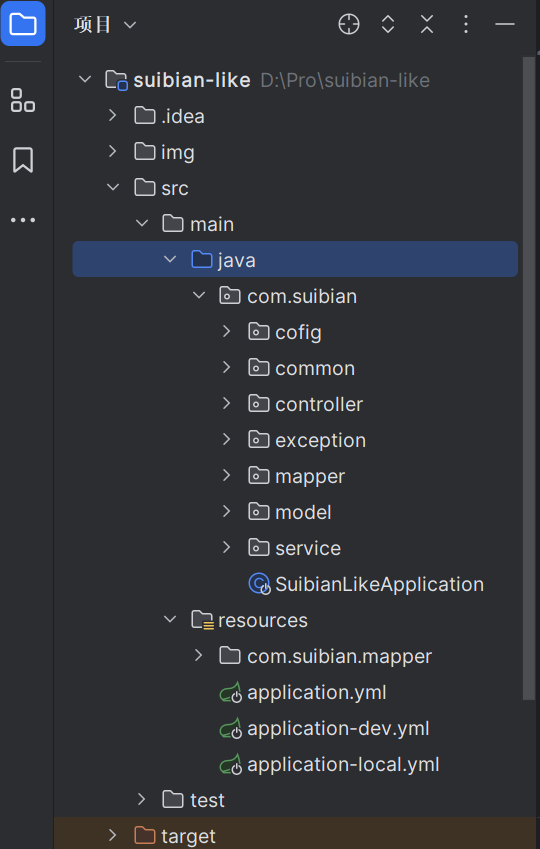

**模块分为用户模块、博客模块、点赞模块**

1. 用户模块

   主要使用 satoken 实现用户的登录退出功能

   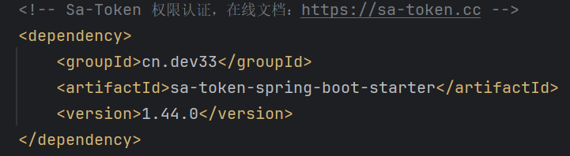

   **Sa-Token** 是一个轻量级 Java 权限认证框架，主要解决：**登录认证**、**权限认证**、**单点登录**、**OAuth2.0**、**分布式Session会话**、**微服务网关鉴权** 等一系列权限相关问题。

   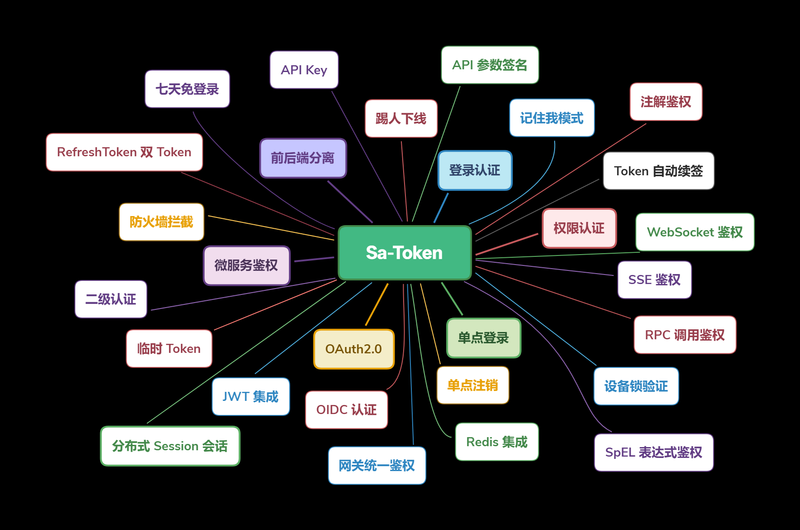

   **只需要简单调用封装好的 Api 就可以实现简单的登录退出并保存token不需要自己手敲实现，详情可查看官网**

   [框架介绍](https://sa-token.cc/doc.html#/)

2. 博客模块

   **调用mp分页查询需要插入mp的分页插件才能查询成功**

   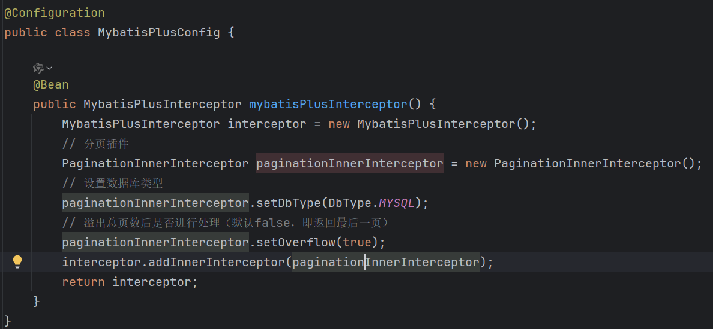

3. 点赞模块

   **在实现点赞和取消点赞业务功能的时候，需要判断用户是否点赞、更新博客表的点赞数量、插入点赞记录，这里一共涉及两张表，需要对两张表进行修改，所以涉及到事务，这里我用的是编程式事务`TransactionTemplate`**

   **另外为了防止由于网络延迟等原因，导致用户点击过快一下子发送多个请求导致点赞重复（用JMeter测试发现确实会出现），所以在这里我加了一共`synchronized`锁，对于锁的对象分以下情况：**

   1. 定义一共全局锁，不过这种情况锁的粒度太大，影响高并发，还可以更优化

   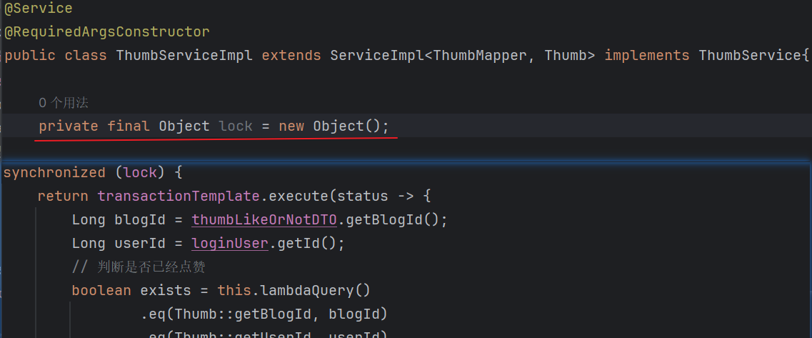

   2. 这里可以通过用户的Id来作为锁，这用锁的只是一个用户而不是所有用户了，这样就可以提高我们的并发量

      **如果只是直接拿用户ID的话，由于每一个ID是引用类型，地址都是不同的很难同一，这里可以借助于`String的常量池`，我们把ID放入String常量池里，那我们从常量池获取的ID都是同一个地址，那么就可以实现锁住同一ID的实现了。**

   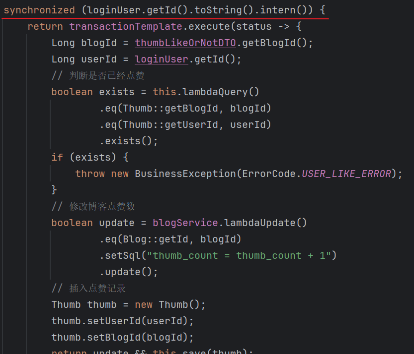

**今日问题**

1. **循环依赖**

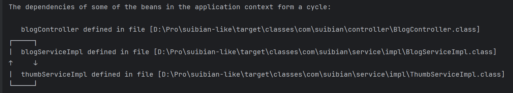

**问题分析**

**循环依赖是指两个模块或多个模块之间相互依赖形成闭环，或者自己依赖自己**

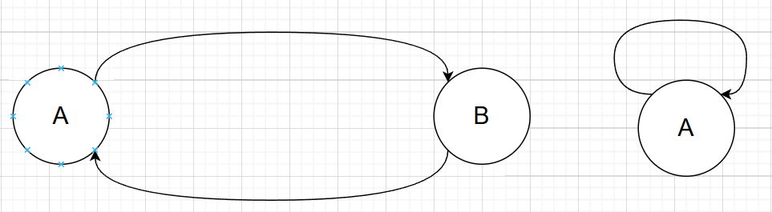

**比如有两个类，类A和类B，如果类A需要调用对象B，类B需要调用对象A，在注入的时候就会参数循环依赖**

```java
@Service
public class A() {
    @Autowired
    private B b;
}

@Service
public class B() {
    @Autowired
    private A a;
}

// 或者自己依赖自己
@Service
public class A() {
    @Autowired
    private A a;
}
```

**如何解决**

**理论上，Spring是通过三级缓存解决循环依赖的（每一个缓存相当于一个map）**

**一级缓存：存储完全初始化好的单例Bean**

**二级缓存：存储未完全初始化完成，但已经实例化好的Bean**

**三级缓存：存储Bean的工厂，我们可以通过工厂获取Bean，用于提前暴露Bean**

**Spring解决循环依赖的步骤**

1. 首先，我们在获取一个Bean的时候，会先去一级缓存中找，如果找到了就之间返回，否则进入下一个步骤
2. 会先判断我们要找的Bean是否在创建，如果没有在创建就直接返回null，如果在创建就在二级缓存中找，如果找到直接返回，没找到进入下一步
3. 在三级缓存中找到对应Bean的工厂，找到了就调用getObject获取该Bean并放入二级缓存中
4. 如果三个缓存都没找到直接返回null

在第二步的时候，会先去判断该Bean是否在创建，如果未创建则直接返回null，然后再去创建，将状态改为正在创建中，进行实例化、属性注入、初始化，无论是否会出现循环依赖，都会将该Bean的工厂放入三级缓存，用于提前暴露Bean

此时Bean A 需要属性注入 B，发现B也没有创建，于是B会走上述A的步骤，然后到B属性注入，它会去三级缓存中找到A对应的工厂，通过工厂获得一个实例化好的Bean A，并删除该工厂将A放入二级缓存中，于是Bean B就可以从二级缓存中获得Bean A并完成属性注入，初始化完成后Bean B就会被放入一级缓存中，

接着到Bean A属性注入，它会从一级缓存获取Bean B，然后完成初始化，删除二级缓存的Bean A，然后加入到一级缓存中。

至此，Bean A、B创建完成，也就解决了循环依赖的问题。

**但是解决循环依赖有两个前提条件**

1. **必须是单例Bean**
2. **属性注入不全是构造器注入，字母序列靠前的不能是构造器注入**

**为什么必须是单例Bean**

​	首先在源码层面上，如果Bean不是单例的就会报错

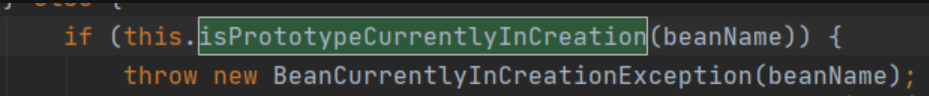

​	其次，如果Bean是原型模式，那么我们在创建A1的时候，发现A依赖于B，就去创建B1，然后B依赖于A，就又去创建A2，又去创建B2，又去创建A3、B3......就在这里卡BUG了

​	如果是单例Bean的话，我们创建Bean A，发现A需要B，这时候先将不完整Bean A放入一个map里，这时候再去创建Bean B，发现B依赖A，就可以从map里获取不完整的Bean A，初始化后Bean B就完整了放入另一个map里，这时候再去属性注入Bean A，于是AB都可以成功创建，且它们相互依赖

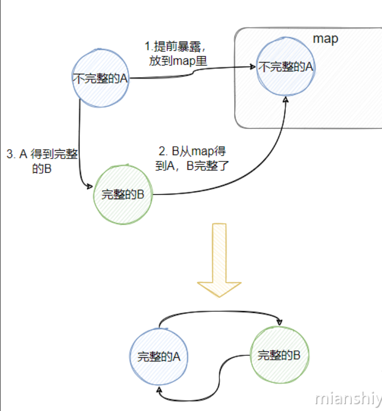

**为什么属性注入不全是构造器注入**

Spring创建Bean分为3个步骤：

	1. 实例化Bean	即new 一个对象
	2. 属性注入         即调用Setter方法
	3. 初始化             即调用各种Aware方法，initMethod，AOP代理等等......

如果都为构造器注入，比如A(B b)，B(A a)，我们在new()一个A对象的时候，构造函数需要B，就去new()一个B对象，然后B又要A就一直new来new去，始终无法获得不完整的Bean A或Bean B

**一个set注入，一个构造器注入就可以吗**

假设A是set注入，B是构造器注入

分析一下：实例化A之后，A进行属性注入，于是去创建B，B通过构造器注入，从map里面获取不完整的A，完成实例化、属性注入、初始化，放入另一个Bean，然后A属性注入、初始化，A和B都成功创建没有问题

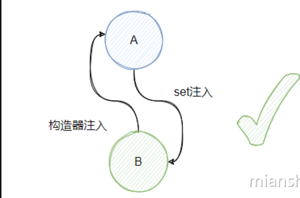

假设A是构造器注入，B是set注入

分析一下：实例化A，也就是new A(B b)的时候发现需要B，于是去创建B，B实例化完成之后，进行属性注入，需要A，此时A还未完成实例化，也就无法从map里面获取Ａ所以Ｂ也卡住了

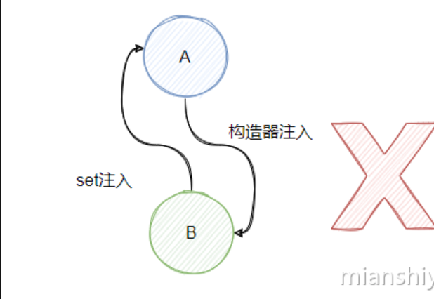

**由于Spring是按照字母序列来创建Bean的所以无法先创建B再创建A**

**实战**

**由以上理论基础，得到的解决办法就是，将字母序列靠前的Bean改为set注入即可，直接添加@Setter注解，注释掉@RequiredArgsConstructor注解**

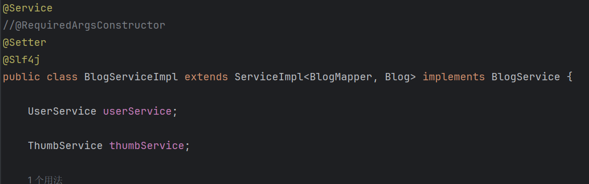

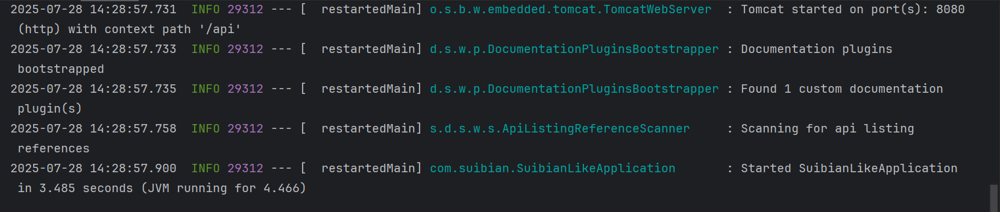

