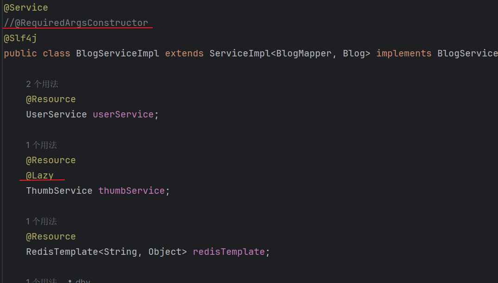

# 亿级流量点赞系统

## 第一天：基础功能开发

**使用 Spring Boot 3 + MyBatis-Plus 快速开发基础点赞功能。**

**接口文档：localhost:8080/api/doc.html**


**项目基础包结构**


**模块分为用户模块、博客模块、点赞模块**

1. 用户模块

   主要使用 satoken 实现用户的登录退出功能

   

   **Sa-Token** 是一个轻量级 Java 权限认证框架，主要解决：**登录认证**、**权限认证**、**单点登录**、**OAuth2.0**、**分布式Session会话**、**微服务网关鉴权** 等一系列权限相关问题。

   

   **只需要简单调用封装好的 Api 就可以实现简单的登录退出并保存token不需要自己手敲实现，详情可查看官网**

   [框架介绍](https://sa-token.cc/doc.html#/)

2. 博客模块

   **调用mp分页查询需要插入mp的分页插件才能查询成功**

   

3. 点赞模块

   **在实现点赞和取消点赞业务功能的时候，需要判断用户是否点赞、更新博客表的点赞数量、插入点赞记录，这里一共涉及两张表，需要对两张表进行修改，所以涉及到事务，这里我用的是编程式事务`TransactionTemplate`**

   **另外为了防止由于网络延迟等原因，导致用户点击过快一下子发送多个请求导致点赞重复（用JMeter测试发现确实会出现），所以在这里我加了一共`synchronized`锁，对于锁的对象分以下情况：**

   1. 定义一共全局锁，不过这种情况锁的粒度太大，影响高并发，还可以更优化

   

   2. 这里可以通过用户的Id来作为锁，这用锁的只是一个用户而不是所有用户了，这样就可以提高我们的并发量

      **如果只是直接拿用户ID的话，由于每一个ID是引用类型，地址都是不同的很难同一，这里可以借助于`String的常量池`，我们把ID放入String常量池里，那我们从常量池获取的ID都是同一个地址，那么就可以实现锁住同一ID的实现了。**

   

**今日问题**

1. **循环依赖**


**问题分析**

**循环依赖是指两个模块或多个模块之间相互依赖形成闭环，或者自己依赖自己**


**比如有两个类，类A和类B，如果类A需要调用对象B，类B需要调用对象A，在注入的时候就会参数循环依赖**

```java
@Service
public class A() {
    @Autowired
    private B b;
}

@Service
public class B() {
    @Autowired
    private A a;
}

// 或者自己依赖自己
@Service
public class A() {
    @Autowired
    private A a;
}
```

**如何解决**

**理论上，Spring是通过三级缓存解决循环依赖的（每一个缓存相当于一个map）**

**一级缓存：存储完全初始化好的单例Bean**

**二级缓存：存储未完全初始化完成，但已经实例化好的Bean**

**三级缓存：存储Bean的工厂，我们可以通过工厂获取Bean，用于提前暴露Bean**

**Spring解决循环依赖的步骤**

1. 首先，我们在获取一个Bean的时候，会先去一级缓存中找，如果找到了就之间返回，否则进入下一个步骤
2. 会先判断我们要找的Bean是否在创建，如果没有在创建就直接返回null，如果在创建就在二级缓存中找，如果找到直接返回，没找到进入下一步
3. 在三级缓存中找到对应Bean的工厂，找到了就调用getObject获取该Bean并放入二级缓存中
4. 如果三个缓存都没找到直接返回null

在第二步的时候，会先去判断该Bean是否在创建，如果未创建则直接返回null，然后再去创建，将状态改为正在创建中，进行实例化、属性注入、初始化，无论是否会出现循环依赖，都会将该Bean的工厂放入三级缓存，用于提前暴露Bean

此时Bean A 需要属性注入 B，发现B也没有创建，于是B会走上述A的步骤，然后到B属性注入，它会去三级缓存中找到A对应的工厂，通过工厂获得一个实例化好的Bean A，并删除该工厂将A放入二级缓存中，于是Bean B就可以从二级缓存中获得Bean A并完成属性注入，初始化完成后Bean B就会被放入一级缓存中，

接着到Bean A属性注入，它会从一级缓存获取Bean B，然后完成初始化，删除二级缓存的Bean A，然后加入到一级缓存中。

至此，Bean A、B创建完成，也就解决了循环依赖的问题。

**但是解决循环依赖有两个前提条件**

1. **必须是单例Bean**
2. **属性注入不全是构造器注入，字母序列靠前的不能是构造器注入**

**为什么必须是单例Bean**

​	首先在源码层面上，如果Bean不是单例的就会报错


​	其次，如果Bean是原型模式，那么我们在创建A1的时候，发现A依赖于B，就去创建B1，然后B依赖于A，就又去创建A2，又去创建B2，又去创建A3、B3......就在这里卡BUG了

​	如果是单例Bean的话，我们创建Bean A，发现A需要B，这时候先将不完整Bean A放入一个map里，这时候再去创建Bean B，发现B依赖A，就可以从map里获取不完整的Bean A，初始化后Bean B就完整了放入另一个map里，这时候再去属性注入Bean A，于是AB都可以成功创建，且它们相互依赖


**为什么属性注入不全是构造器注入**

Spring创建Bean分为3个步骤：

	1. 实例化Bean	即new 一个对象
	2. 属性注入         即调用Setter方法
	3. 初始化             即调用各种Aware方法，initMethod，AOP代理等等......

如果都为构造器注入，比如A(B b)，B(A a)，我们在new()一个A对象的时候，构造函数需要B，就去new()一个B对象，然后B又要A就一直new来new去，始终无法获得不完整的Bean A或Bean B

**一个set注入，一个构造器注入就可以吗**

假设A是set注入，B是构造器注入

分析一下：实例化A之后，A进行属性注入，于是去创建B，B通过构造器注入，从map里面获取不完整的A，完成实例化、属性注入、初始化，放入另一个Bean，然后A属性注入、初始化，A和B都成功创建没有问题


假设A是构造器注入，B是set注入

分析一下：实例化A，也就是new A(B b)的时候发现需要B，于是去创建B，B实例化完成之后，进行属性注入，需要A，此时A还未完成实例化，也就无法从map里面获取Ａ所以Ｂ也卡住了


**由于Spring是按照字母序列来创建Bean的所以无法先创建B再创建A**

**实战**

**由以上理论基础，得到的解决办法就是，将字母序列靠前的Bean延迟加载，直接添加@Lazy注解，注释掉@RequiredArgsConstructor注解，将构造器注入改为字段注入，当然Setter注入也可以**




## 第二天：Redis优化 + 循环依赖Bug修复

**今天使用Redis存储点赞状态，以减轻数据库的压力，这里自然采用Hash数据结构**

**方案一**

Key为用户ID，HashKey为博客ID，HashValue为点赞记录ID


​	**优点：直接根据用户ID就可以直接搜索到该用户的所有点赞博客** 

​	**缺点：如果要查询博客的点赞用户则要遍历全部的记录**

**方案二**

Key为博客ID，HashKey为用户ID，HashValue为点赞记录ID


​	**优点：直接根据博客ID就可以直接搜索到该博客的所有点赞用户** 

​	**缺点：如果要查询用户的点赞博客则要遍历全部的记录**

**由于业务涉及到查看用户所有博客，这里选择方案一，如果要扩展查看博客所有点赞用户可以把方案二添上**

**RedisUtil类获得RedisKey**


**在多处地方涉及判断是否点赞，这里把数据库查询，改为Redis查询**


**对应点赞，取消点赞，根据ID查询博客，批量查询博客都要更改**

```java
	/**
     * 点赞
     *
     * @param thumbLikeOrNotDTO 点赞或取消点赞参数列表
     * @return 是否成功
     */
    @Override
    public Boolean doThumb(ThumbLikeOrNotDTO thumbLikeOrNotDTO) {
        		......
                // 缓存点赞记录
                if (success) {
                    redisTemplate.opsForHash().put(RedisKeyUtil.getUserThumbKey(userId), blogId.toString(), 					thumb.getId());
                }
                return success;
            });
        }
    }
```

```
	/**
     * 取消点赞
     *
     * @param thumbLikeOrNotDTO 点赞或取消点赞参数列表
     * @return 是否成功
     */
    @Override
    public Boolean undoThumb(ThumbLikeOrNotDTO thumbLikeOrNotDTO) {
        // 删除点赞记录
        synchronized (loginUser.getId().toString().intern()) {
            return transactionTemplate.execute(status -> {
                Long blogId = thumbLikeOrNotDTO.getBlogId();
                Long userId = loginUser.getId();
                // 判断是否已经点赞
                Long thumbId = Long.valueOf(Objects.requireNonNull(redisTemplate
                                .opsForHash()
                                .get(RedisKeyUtil.getUserThumbKey(userId), blogId.toString()))
                        .toString());
                // 修改博客点赞数
                boolean update = blogService.lambdaUpdate()
                        .eq(Blog::getId, blogId)
                        .setSql("thumb_count = thumb_count - 1")
                        .update();
                boolean success = update && this.removeById(thumbId);
                // 删除缓存记录
                if (success) {
                    redisTemplate.opsForHash().delete(RedisKeyUtil.getUserThumbKey(userId), 									blogId.toString());
                }
                return success;
            });
        }
    }
```

**分页获取博客列表这里暂时还是数据库查询，后期再优化，但是查询博客点赞记录这里做了一个小优化，并没有再调用之前的getBlogVO方法，该方法是通过redisTemplate.opsForHash().hasKey(RedisKeyUtil.getUserThumbKey(userId), blogId.toString());查看当前登录用户与博客是否点赞的关系，但是一旦博客多起来，那么博客有多少我就要发送多少次请求到redis里，与redis就要建立多少次连接，这里直接采用redisTemplate.opsForHash().multiGet(RedisKeyUtil.getUserThumbKey(userId), blogIdsList)这样只与redis建立一次连接**

**业务逻辑大概是：先数据库查博客数据`blogList`，再获得博客的所有ID`blogList`，如果用户已经登录，就批量查询Redis该用户与对应博客是否点赞，封装为Map<Long, Boolean>`thumbMap`，Key表示博客ID，Value表示是否点赞，最用通过stream流封装VO返回**

```
	/**
     * 分页获取博客列表
     * @param blogPageReqDTO 博客分页请求参数
     * @return 博客列表
     */
    @Override
    public PageResult<BlogVO> getBlogPage(BlogPageReqDTO blogPageReqDTO) {
        // mp 的分页查询
        Page<Blog> page = new Page<>();
        page.setCurrent(blogPageReqDTO.getPageNo());
        page.setSize(blogPageReqDTO.getPageSize());
        Page<Blog> blogPage = this.page(page, new LambdaQueryWrapper<Blog>()
                .like(Objects.nonNull(blogPageReqDTO.getBlogName()), Blog::getTitle, 										blogPageReqDTO.getBlogName()));
        // 获取查询后的分页结果
        List<Blog> blogList = blogPage.getRecords();
        if (blogList == null || blogList.isEmpty()) {
            return PageResult.empty();
        }
        // 获取博客Ids
        List<Object> blogIdsList = blogList.stream().map(blog -> 														blog.getId().toString()).collect(Collectors.toList());
        // 获取用户点赞记录
        HashMap<Long, Boolean> thumbMap = new HashMap<>(blogIdsList.size());
        // 获取用户数据 Key 为博客ID Value 为是否点赞
        User loginUser = userService.getLoginUser();
        if (ObjectUtil.isNotEmpty(loginUser)) {
            Long userId = loginUser.getId();
            // 批量获取用户点赞记录, Key 为博客ID Value 为是否点赞
            getThumbMap(userId, blogIdsList, thumbMap);
        }
        List<BlogVO> blogVOList = blogList.stream()
                .map(blog -> {
                    BlogVO blogVO = BeanUtil.copyProperties(blog, BlogVO.class);
                    blogVO.setHasThumb(thumbMap.getOrDefault(blog.getId(), false));
                    return blogVO;
                })
                .collect(Collectors.toList());
        return new PageResult<>(blogVOList, blogPage.getTotal());
    }

    private void getThumbMap(Long userId, List<Object> blogIdsList, HashMap<Long, Boolean> thumbMap) {
        List<Boolean> userThumbs = redisTemplate.opsForHash()
                .multiGet(RedisKeyUtil.getUserThumbKey(userId), blogIdsList)
                .stream()
                .map(Objects::nonNull)
                .collect(Collectors.toList());
        for (int i = 0; i < blogIdsList.size(); i ++ ) {
            thumbMap.put(Long.valueOf(blogIdsList.get(i).toString()), userThumbs.get(i));
        }
    }
```

**最好添加satoken集成Redis的依赖，只要添加依赖，satoken会自己维护用户登录信息，不需要我们手动维护**

```
		<!-- Sa-Token 整合 RedisTemplate -->
        <dependency>
            <groupId>cn.dev33</groupId>
            <artifactId>sa-token-redis-template</artifactId>
            <version>1.44.0</version>
        </dependency>

        <!-- 提供 Redis 连接池 -->
        <dependency>
            <groupId>org.apache.commons</groupId>
            <artifactId>commons-pool2</artifactId>
        </dependency>
```


**注意**

```
				// 判断是否已经点赞
                Long thumbId = Long.valueOf(Objects.requireNonNull(redisTemplate
                                .opsForHash()
                                .get(RedisKeyUtil.getUserThumbKey(userId), blogId.toString()))
                        .toString());
```

**这里redisTemplate返回的thumbId默认是Integer类型，需要注意的是这里不能用(Long)类型强转，因为Integer与Long两个类是并集的彼此不是谁的子类，这种强转方式只能用在基本数据类型，所以要采用上述方式，先toString，在Long.valueOf**

**当然也可以，在redisTemplate返回Object类型后强转Integer类型在用Integer，因为redis默认是用Integer类型存的，再采用Integer的longValue()方法**


## 第三天：优化Redis的写操作，针对点赞和取消点赞在高并发情况下的性能瓶颈

**在此之前，我已经将JDK版本升级到21版本，因为这一次涉及到虚拟线程，代码块等相关内容，并且顺带的，将Springboot版本也升到了3.xx，这里需要注意到是在使用Spring boot3时对应的很多依赖到需要升级，比如：Mybatis-plus, hutool-all, Knif4j......并且Spring boot版本也不能太高，否则会出现各种依赖不兼容的问题，如果启动程序报错，比如某某方法，某某Bean未找到，基本都是版本不兼容的问题**

**本期优化，点赞的所有记录都存储在Redis中，不直接插入数据库，再加一个定时任务，每隔一段时间定时同步Redis与Mysql的数据**

**首先Redis的点赞记录，我是以用户Id为Redis的Key，博客Id为Hash的Key，先将value优化为Boolean**

**又加入一个临时操作记录，·**

**这里的Key我选择的是以10s为单位的一个时间片，比如 `16:02:00` ~ `16:02:09` 都以`16:02:00`为键**

**Key: thumb:temp:{时间}, 如: thumb:temp:16:02:00**

**Field: {userId}:{blogId}**

**Value: {"type":(1-点赞，-1-取消点赞，0-为变化), "time": "点赞时间"}**


**点赞流程**


**取消点赞流程**


**定时任务流程**


**在执行点赞或取消点赞操作时，我们要保证一致性问题，即操作要么全部成功，要么全部失败，于是可以借助于Lua脚本来保证我们的原子性问题**

**这里补充一下，Lua脚本本身其实并不能实现我们的原子性问题，但是由于Redis是单线程执行的，也就是是说它会按照顺序一条一条执行Lua脚本里的Redis命令，从而保证了原子性**

**这里提供Lua脚本常量，其中JDK21通过三个引号如`“”“`定义代码块**

```java
package com.suibian.constant;

import cn.hutool.core.date.DateTime;
import cn.hutool.core.date.DateUtil;
import org.springframework.data.redis.core.script.DefaultRedisScript;
import org.springframework.data.redis.core.script.RedisScript;

public class RedisLuaScriptConstant {

    /**
     * 点赞脚本
     * KEYS[1]  -- 临时计数键
     * KEYS[2]  -- 用户点赞状态键
     * ARGV[1]  -- 用户ID
     * ARGV[2]  -- 博客ID
     * ARGV[3]  -- 点赞时间
     * <p>
     * return：
     * 1：成功
     * -1：已点赞
     */
    public static final RedisScript<Long> THUMB_SCRIPT = new DefaultRedisScript<>("""
            local tempThumbKey = KEYS[1]    -- 临时计数键，例如：[thumb:temp:{timeSlice}]
            local userThumbKey = KEYS[2]    -- 用户点赞状态键，例如：[thumb:{userId}]
            local userId = ARGV[1]          -- 用户ID
            local blogId = ARGV[2]          -- 博客ID
            local currentTime = ARGV[3]     -- 点赞时间
                        
            -- 1. 检测是否已经点赞（避免重复操作）
            if redis.call('HEXISTS', userThumbKey, blogId) == 1 then
                return -1                   -- 如果已经点赞，返回-1表示操作失败
            end
                        
            -- 2. 获取旧值，不存在则为0     .. 拼接字符串
            local hashKey = userId .. ":" .. blogId
            local oldValue = redis.call('HGET', tempThumbKey, hashKey)
            if oldValue == false then
                oldValue = '{"type": 0, "time": ""}'
            end
            
            -- 3. 解析旧值
            local oldData = cjson.decode(oldValue)
            local oldType = oldData.type
            local oldTime = oldData.time
                        
            -- 4. 计算新值
            -- 旧值可能为0，再+1就是执行点赞操作，为-1，再+1就是0没有任何变化，不操作数据库
            local newType = 1
            local newValue = '{"type": ' .. newType .. ', "time": ' .. currentTime .. '}'
                        
            -- 4. 原子化更新：写入临时计数 并 标记用户点赞状态
            redis.call('HSET', tempThumbKey, hashKey, newValue)
            redis.call('HSET', userThumbKey, blogId, 1)
                        
            -- 5. 返回1，表示成功
            return 1
            """, Long.class);

    /**
     * 取消点赞脚本
     * KEYS[1]  -- 临时计数键
     * KEYS[2]  -- 用户点赞状态键
     * ARGV[1]  -- 用户ID
     * ARGV[2]  -- 博客ID
     * ARGV[3]  -- 点赞时间
     * <p>
     * return：
     * 1：成功
     * -1：未点赞
     */
    public static final RedisScript<Long> UNTHUMB_SCRIPT = new DefaultRedisScript<>("""
            local tempThumbKey = KEYS[1]    -- 临时计数键，例如：[thumb:temp:{timeSlice}]
            local userThumbKey = KEYS[2]    -- 用户点赞状态键，例如：[thumb:{userId}]
            local userId = ARGV[1]            -- 用户ID
            local blogId = ARGV[2]            -- 博客ID
            local currentTime = ARGV[3]
                        
            -- 1. 检测是否已经点赞（避免重复操作）
            if redis.call('HEXISTS', userThumbKey, blogId) ~= 1 then
                return -1                     -- 如果没有点赞记录，返回-1表示操作失败
            end
                        
            -- 2. 获取旧值，不存在则为0     .. 拼接字符串
            local hashKey = userId .. ":" .. blogId
            local oldValue = redis.call('HGET', tempThumbKey, hashKey)
            if oldValue == false then
                oldValue = '{"type": 0, "time": ""}'
            end
            
            -- 3. 解析旧值
            local oldData = cjson.decode(oldValue)
            local oldType = oldData.type
            local oldTime = oldData.time
                        
            -- 4. 计算新值
            -- 旧值可能为0，再+1就是执行点赞操作，为-1，再+1就是0没有任何变化，不操作数据库
            local newNumber = oldType - 1
            local newValue = '{"type":' .. newNumber .. ',"time":'.. currentTime ..'}'
                        
            -- 4. 原子化更新：写入临时计数 并 标记用户点赞状态
            redis.call('HSET', tempThumbKey, hashKey, newValue)
            redis.call('HDEL', userThumbKey, blogId)
                        
            -- 5. 返回1，表示成功
            return 1
            """, Long.class);


}
```

**再创建ThumbRedisServiceImpl 执行Lua脚本业务**

```java
package com.suibian.service.impl;

import cn.hutool.core.date.DateTime;
import cn.hutool.core.date.DateUtil;
import com.baomidou.mybatisplus.extension.service.impl.ServiceImpl;
import com.suibian.common.ErrorCode;
import com.suibian.constant.RedisLuaScriptConstant;
import com.suibian.exception.BusinessException;
import com.suibian.mapper.ThumbMapper;
import com.suibian.model.dto.thumb.ThumbLikeOrNotDTO;
import com.suibian.model.entity.Thumb;
import com.suibian.model.entity.User;
import com.suibian.model.enums.LuaTypeEnum;
import com.suibian.service.ThumbService;
import com.suibian.service.UserService;
import com.suibian.util.RedisKeyUtil;
import lombok.RequiredArgsConstructor;
import org.springframework.context.annotation.Primary;
import org.springframework.data.redis.core.RedisTemplate;
import org.springframework.stereotype.Service;

import java.util.Arrays;
import java.util.Optional;

/**
 * @author suibian
 * @ description 针对表【thumb(点赞记录表)】的数据库操作Service实现
 * @ createDate 2025-07-23 10:37:01
 */
@Service("ThumbService")
@Primary
@RequiredArgsConstructor
public class ThumbRedisServiceImpl extends ServiceImpl<ThumbMapper, Thumb> implements ThumbService {

    private final UserService userService;

    private final RedisTemplate<String, Object> redisTemplate;

    /**
     * 点赞
     *
     * @param thumbLikeOrNotDTO 点赞或取消点赞参数列表
     * @return 是否成功
     */
    @Override
    public Boolean doThumb(ThumbLikeOrNotDTO thumbLikeOrNotDTO) {
        // 参数校验并获取登录用户
        User loginUser = validateRequestAndGetUser(thumbLikeOrNotDTO);
        Long userId = loginUser.getId();
        Long blogId = thumbLikeOrNotDTO.getBlogId();
        // 获得时间
        String timeSlice = getTimeSlice();
        // 获得Redis的Key
        String userThumbKey = RedisKeyUtil.getUserThumbKey(userId);
        String tempThumbKey = RedisKeyUtil.getTempThumbKey(timeSlice);
        // 执行 Lua 脚本
        Long result = redisTemplate.execute(
                RedisLuaScriptConstant.THUMB_SCRIPT,
                Arrays.asList(tempThumbKey, userThumbKey),
                userId,
                blogId,
                DateUtil.format(DateUtil.date(), "yyyy-MM-dd HH:mm:ss"));
        // 根据返回值判断 Lua 脚本执行情况
        if (null == result || result.equals(LuaTypeEnum.FAIL.getValue())) {
            throw new BusinessException(ErrorCode.USER_LIKE_ERROR);
        }
        return result.equals(LuaTypeEnum.SUCCESS.getValue());
    }

    /**
     * 取消点赞
     *
     * @param thumbLikeOrNotDTO 点赞或取消点赞参数列表
     * @return 是否成功
     */
    @Override
    public Boolean undoThumb(ThumbLikeOrNotDTO thumbLikeOrNotDTO) {
        // 参数校验并获取登录用户
        User loginUser = validateRequestAndGetUser(thumbLikeOrNotDTO);
        // 获取用户Id 和 博客Id
        Long userId = loginUser.getId();
        Long blogId = thumbLikeOrNotDTO.getBlogId();
        // 获取当前时间片
        String timeSlice = getTimeSlice();
        // 获取Redis的Key
        String userThumbKey = RedisKeyUtil.getUserThumbKey(userId);
        String tempThumbKey = RedisKeyUtil.getTempThumbKey(timeSlice);
        // 执行 Lua 脚本
        Long result = redisTemplate.execute(
                RedisLuaScriptConstant.UNTHUMB_SCRIPT,
                Arrays.asList(tempThumbKey, userThumbKey),
                userId,
                blogId,
                DateUtil.format(DateUtil.date(), "yyyy-MM-dd HH:mm:ss")
        );
        // 根据返回值判断 Lua 脚本执行情况
        if (null == result || result.equals(LuaTypeEnum.FAIL.getValue())) {
            throw new BusinessException(ErrorCode.USER_UNLIKE_ERROR);
        }
        return result.equals(LuaTypeEnum.SUCCESS.getValue());
    }

    /**
     * 判断用户是否点赞
     *
     * @param userId 用户Id
     * @param blogId 博客Id
     * @return 是否点赞
     */
    @Override
    public Boolean isThumb(Long userId, Long blogId) {
        return redisTemplate.opsForHash().hasKey(RedisKeyUtil.getUserThumbKey(userId), blogId.toString());
    }

    /**
     * 获取时间片
     * 以 10 秒为一个时间片
     *
     * @return 时间片， 返回时间格式 12:16:30
     */
    private String getTimeSlice() {
        // 获得当前时间
        DateTime nowDate = DateUtil.date();
        // 获得初始秒
        int second = (DateUtil.second(nowDate) / 10) * 10;
        // 返回时间格式 HH:mm:ss
        return DateUtil.format(nowDate, "HH:mm:") + (second == 0 ? "00" : second);
    }

    /**
     * 参数列表校验并返回登录用户
     *
     * @param thumbLikeOrNotDTO 点赞或取消点赞参数列表
     * @return 登录用户
     */
    private User validateRequestAndGetUser(ThumbLikeOrNotDTO thumbLikeOrNotDTO) {
        if (null == thumbLikeOrNotDTO || thumbLikeOrNotDTO.getBlogId() == null) {
            throw new BusinessException(ErrorCode.BAD_REQUEST_PARAMS);
        }
        return Optional.ofNullable(userService.getLoginUser())
                .orElseThrow(() -> new BusinessException(ErrorCode.UNAUTHORIZED));
    }
}
```

**批量更新博客点赞数量**

**这里需要注意，批量更新博客点赞数量是自己在xml文件里实现的，当然用MP也是可以实现的，但是这会带来性能问题，MP的批量更新默认是向数据库发送多个请求进行更新，一个请求就要与数据库建立一次连接，就算使用MP插件，那也是将一条条的update语句拼接成一条，比如：update.......update......update......这样并且也有数量限制默认好像是1000条，但是自己在xml文件就可以使用foreach遍历集合，只需要一条sql语句，并且与数据库也只建立了一次连接，大大提升了性能**

```
// BlogMapper.java
/**
 * 批量更新点赞数
 * @param countMap 键：blogId，值：点赞数
 */
void batchUpdateThumbCount(@Param("countMap") Map<Long, Long> countMap);

// BlogMapper.xml
<update id="batchUpdateThumbCount">
	update blog
	set thumb_count = thumb_count + CASE id
	<foreach collection="countMap.entrySet()" item="value" index="key">
	    WHEN #{key} THEN #{value}
	</foreach>
	END
	where id in
	<foreach collection="countMap.keySet()" item="id" open="(" separator="," close=")">
	    #{id}
	</foreach>
</update>
```

**定时任务实现**

**记得在启动类加@EnableScheduling**

**JDK21的虚拟线程，可以说是协程在Java中的实现，协程具有以下特点：**


```java
package com.suibian.job;

import cn.hutool.core.bean.BeanUtil;
import cn.hutool.core.collection.CollUtil;
import cn.hutool.core.date.DateTime;
import cn.hutool.core.date.DateUtil;
import cn.hutool.core.text.StrPool;
import com.baomidou.mybatisplus.core.conditions.query.LambdaQueryWrapper;
import com.suibian.mapper.BlogMapper;
import com.suibian.model.dto.thumb.ThumbTempCacheDTO;
import com.suibian.model.entity.Thumb;
import com.suibian.model.enums.ThumbTypeEnum;
import com.suibian.service.ThumbService;
import com.suibian.util.RedisKeyUtil;
import lombok.extern.slf4j.Slf4j;
import org.springframework.data.redis.core.RedisTemplate;
import org.springframework.scheduling.annotation.Scheduled;
import org.springframework.stereotype.Component;
import org.springframework.transaction.annotation.Transactional;

import javax.annotation.Resource;
import java.util.*;

@Component
@Slf4j
public class SyncThumb2DBJob {

    @Resource
    ThumbService thumbService;

    @Resource
    BlogMapper blogMapper;

    @Resource
    RedisTemplate<String, Object> redisTemplate;

    public static final int SECOND_BUG = -10;

    /**
     * 每10秒执行一次
     */
    @Scheduled(fixedRate = 10000)
    @Transactional(rollbackFor = Exception.class)
    public void run() {
        log.info("定时任务：将 Redis中的临时点赞数据同步到数据库");
        // 获取当前时间片的初始时间
        DateTime nowDate = DateUtil.date();
        // 处理上一个10s的数据
        int second = (DateUtil.second(nowDate) / 10 - 1) * 10;
        if (second == SECOND_BUG) {
            second = 50;
            // 回到上一分钟
            nowDate = DateUtil.offsetMinute(nowDate, -1);
        }
        String timeSlice = DateUtil.format(nowDate, "HH:mm:") + (second == 0 ? "00" : second);
        syncThumb2DbByDate(timeSlice);
        log.info("同步完成，当前时间片：{}", timeSlice);
    }

    // 同步数据到数据库
    // 删除临时点赞记录
    public void syncThumb2DbByDate(String date) {
        // 获得临时点赞Key
        String tempThumbKey = RedisKeyUtil.getTempThumbKey(date);
        // 获得date时间片所有的临时点赞和取消点赞操作
        Map<Object, Object> allTempThumbMap = redisTemplate.opsForHash().entries(tempThumbKey);
        // 临时点赞数据为空直接返回
        if (CollUtil.isEmpty(allTempThumbMap)) {
            return;
        }
        // 用来记录博客点赞量
        Map<Long, Long> blogThumbCountMap = new HashMap<>();
        // 点赞记录列表，用来批量插入数据库
        List<Thumb> thumbList = new ArrayList<>();
        // 分装要删除点赞记录的查询条件
        boolean needDelete = false;
        LambdaQueryWrapper<Thumb> delWrapper = new LambdaQueryWrapper<>();
        // 遍历所有临时点赞记录
        for (Object userIdBlogIdObject : allTempThumbMap.keySet()) {
            // 获得用户Id和博客Id
            String userIdBlogIdStr = (String) userIdBlogIdObject;
            String[] uiAndBi = userIdBlogIdStr.split(StrPool.COLON);
            // 用户Id
            Long userId = Long.valueOf(uiAndBi[0]);
            // 博客Id
            Long blogId = Long.valueOf(uiAndBi[1]);
            // 临时点赞操作
            // {"type":1,time:'2025-01-01 00:00:00'}  -1 取消点赞，1 点赞
            Object value = allTempThumbMap.get(userIdBlogIdObject);
            ThumbTempCacheDTO thumbTemp = BeanUtil.toBean(value, ThumbTempCacheDTO.class);
            if (thumbTemp == null) {
                continue;
            }
            Integer thumbType = Optional.ofNullable(thumbTemp.getType()).orElse(0);
            // 点赞操作，保存点赞记录
            if (ThumbTypeEnum.INCR.getValue() == thumbType) {
                Thumb thumb = new Thumb();
                thumb.setUserId(userId);
                thumb.setBlogId(blogId);
                thumbList.add(thumb);
                // 取消点赞操作，保存取消点赞记录
            } else if (ThumbTypeEnum.DECR.getValue() == thumbType) {
                needDelete = true;
                delWrapper.eq(Thumb::getUserId, userId).eq(Thumb::getBlogId, blogId);
            } else if (ThumbTypeEnum.NON.getValue() == thumbType) {
                log.warn("数据异常：{}", userId + "," + blogId + "," + thumbType);
            }
            // 计算点赞增量
            blogThumbCountMap.put(blogId, blogThumbCountMap.getOrDefault(blogId, 0L) + thumbType);
        }
        // 批量插入点赞记录
        thumbService.saveBatch(thumbList);
        // 批量删除点赞记录
        if (needDelete) {
            thumbService.remove(delWrapper);
        }
        // 批量更新点赞数
        if (CollUtil.isNotEmpty(blogThumbCountMap)) {
            blogMapper.batchUpdateThumbCount(blogThumbCountMap);
        }
        // 异步删除临时点赞记录
        // 利用Java21的虚拟线程
        Thread.startVirtualThread(() -> redisTemplate.delete(tempThumbKey));
    }
}

```

**补偿任务实现**

```java
package com.suibian.job;

import cn.hutool.core.collection.CollUtil;
import cn.hutool.core.util.ObjUtil;
import com.suibian.constant.ThumbConstant;
import com.suibian.util.RedisKeyUtil;
import lombok.extern.slf4j.Slf4j;
import org.springframework.data.redis.core.RedisTemplate;
import org.springframework.scheduling.annotation.Scheduled;
import org.springframework.stereotype.Component;

import javax.annotation.Resource;
import java.util.HashSet;
import java.util.Set;

@Component
@Slf4j
public class SyncThumb2DBCompensatoryJob {

    @Resource
    SyncThumb2DBJob syncThumb2DBJob;

    @Resource
    RedisTemplate<String, Object> redisTemplate;

    /**
     * 定时任务，每天2点执行一次，用于补偿点赞数据
     */

//    @Scheduled(cron = "0 0 2 * * *")
    @Scheduled(cron = "0 1 * * * *")
    public void run() {
        log.info("开始补偿点赞数据");
        //
        Set<String> thumbKeys = redisTemplate.keys(RedisKeyUtil.getTempThumbKey("") + "*");
        if (thumbKeys == null || CollUtil.isEmpty(thumbKeys)) {
            return;
        }
        // 用于存储要处理的日期
        Set<String> needHandleDateSet = new HashSet<>();
        // 获取所有日期
        thumbKeys.stream()
                .filter(ObjUtil::isNotNull)
                .forEach(thumbKey -> needHandleDateSet.add(thumbKey.replace(ThumbConstant.TEMP_THUMB_KEY_PREFIX.formatted(""), "")));
        // 如果没有要处理的直接返回
        if (CollUtil.isEmpty(needHandleDateSet)) {
            log.info("没有需要补偿的临时数据");
            return;
        }
        // 遍历所有日期
        for (String date : needHandleDateSet) {
            syncThumb2DBJob.syncThumb2DbByDate(date);
        }
        log.info("补偿点赞数据完成");
    }
}
```

**问题：**


**这个是由于我构建的JSON字符串与JackSon的序列化规则不兼容：**

**这种手动生成的 JSON 不包含 Jackson 要求的类型信息（如 `["com.example.ThumbTempCacheDTO", {...}]`），导致反序列化失败。**

**解决办法就是直接禁用JackSon的类型信息**

```java
@Bean
    public RedisTemplate<String, Object> redisTemplate(RedisConnectionFactory connectionFactory) {
        RedisTemplate<String, Object> template = new RedisTemplate<>();
        template.setConnectionFactory(connectionFactory);

        // 使用 Jackson2JsonRedisSerializer 序列化值
        ObjectMapper objectMapper = new ObjectMapper();
//        objectMapper.activateDefaultTyping(LaissezFaireSubTypeValidator.instance, ObjectMapper.DefaultTyping.NON_FINAL);
        Jackson2JsonRedisSerializer<Object> serializer = new Jackson2JsonRedisSerializer<>(Object.class);
        serializer.setObjectMapper(objectMapper);

        // Key 使用 String 序列化
        template.setKeySerializer(new StringRedisSerializer());
        template.setValueSerializer(serializer);
        template.setHashKeySerializer(new StringRedisSerializer());
        template.setHashValueSerializer(serializer);

        template.afterPropertiesSet();
        return template;
    }
```

