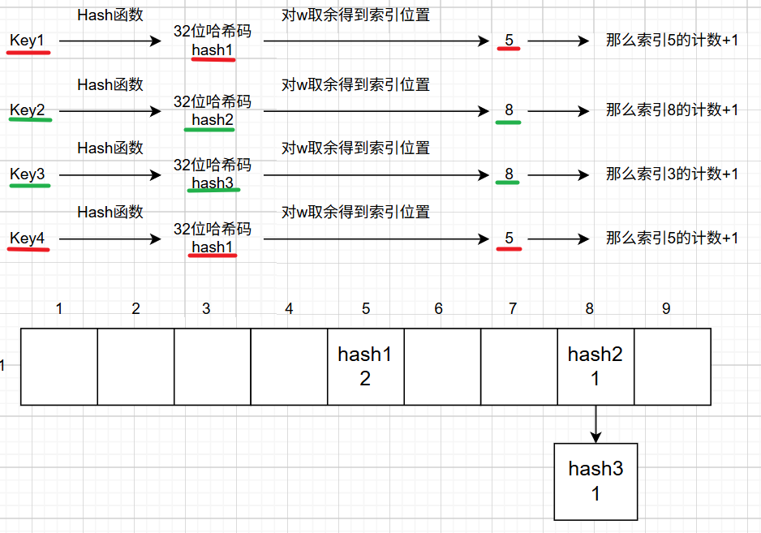
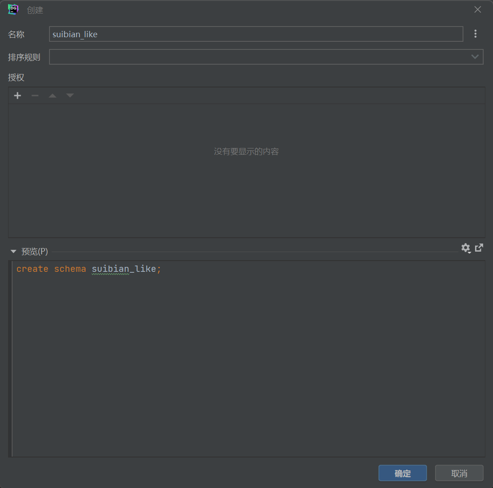

# 亿级流量点赞系统

## 第一天：基础功能开发

**使用 Spring Boot 3 + MyBatis-Plus 快速开发基础点赞功能。**

**接口文档：localhost:8888/api/doc.html**


**项目基础包结构**


**模块分为用户模块、博客模块、点赞模块**

1. 用户模块

   主要使用 satoken 实现用户的登录退出功能

   

   **Sa-Token** 是一个轻量级 Java 权限认证框架，主要解决：**登录认证**、**权限认证**、**单点登录**、**OAuth2.0**、**分布式Session会话**、**微服务网关鉴权** 等一系列权限相关问题。

   

   **只需要简单调用封装好的 Api 就可以实现简单的登录退出并保存token不需要自己手敲实现，详情可查看官网**

   [框架介绍](https://sa-token.cc/doc.html#/)

2. 博客模块

   **调用mp分页查询需要插入mp的分页插件才能查询成功**

   

3. 点赞模块

   **在实现点赞和取消点赞业务功能的时候，需要判断用户是否点赞、更新博客表的点赞数量、插入点赞记录，这里一共涉及两张表，需要对两张表进行修改，所以涉及到事务，这里我用的是编程式事务`TransactionTemplate`**

   **另外为了防止由于网络延迟等原因，导致用户点击过快一下子发送多个请求导致点赞重复（用JMeter测试发现确实会出现），所以在这里我加了一共`synchronized`锁，对于锁的对象分以下情况：**

   1. 定义一共全局锁，不过这种情况锁的粒度太大，影响高并发，还可以更优化

   

   2. 这里可以通过用户的Id来作为锁，这用锁的只是一个用户而不是所有用户了，这样就可以提高我们的并发量

      **如果只是直接拿用户ID的话，由于每一个ID是引用类型，地址都是不同的很难同一，这里可以借助于`String的常量池`，我们把ID放入String常量池里，那我们从常量池获取的ID都是同一个地址，那么就可以实现锁住同一ID的实现了。**

   

**今日问题**

1. **循环依赖**


**问题分析**

**循环依赖是指两个模块或多个模块之间相互依赖形成闭环，或者自己依赖自己**


**比如有两个类，类A和类B，如果类A需要调用对象B，类B需要调用对象A，在注入的时候就会参数循环依赖**

```java
@Service
public class A() {
    @Autowired
    private B b;
}

@Service
public class B() {
    @Autowired
    private A a;
}

// 或者自己依赖自己
@Service
public class A() {
    @Autowired
    private A a;
}
```

**如何解决**

**理论上，Spring是通过三级缓存解决循环依赖的（每一个缓存相当于一个map）**

**一级缓存：存储完全初始化好的单例Bean**

**二级缓存：存储未完全初始化完成，但已经实例化好的Bean**

**三级缓存：存储Bean的工厂，我们可以通过工厂获取Bean，用于提前暴露Bean**

**Spring解决循环依赖的步骤**

1. 首先，我们在获取一个Bean的时候，会先去一级缓存中找，如果找到了就之间返回，否则进入下一个步骤
2. 会先判断我们要找的Bean是否在创建，如果没有在创建就直接返回null，如果在创建就在二级缓存中找，如果找到直接返回，没找到进入下一步
3. 在三级缓存中找到对应Bean的工厂，找到了就调用getObject获取该Bean并放入二级缓存中
4. 如果三个缓存都没找到直接返回null

在第二步的时候，会先去判断该Bean是否在创建，如果未创建则直接返回null，然后再去创建，将状态改为正在创建中，进行实例化、属性注入、初始化，无论是否会出现循环依赖，都会将该Bean的工厂放入三级缓存，用于提前暴露Bean

此时Bean A 需要属性注入 B，发现B也没有创建，于是B会走上述A的步骤，然后到B属性注入，它会去三级缓存中找到A对应的工厂，通过工厂获得一个实例化好的Bean A，并删除该工厂将A放入二级缓存中，于是Bean B就可以从二级缓存中获得Bean A并完成属性注入，初始化完成后Bean B就会被放入一级缓存中，

接着到Bean A属性注入，它会从一级缓存获取Bean B，然后完成初始化，删除二级缓存的Bean A，然后加入到一级缓存中。

至此，Bean A、B创建完成，也就解决了循环依赖的问题。

**但是解决循环依赖有两个前提条件**

1. **必须是单例Bean**
2. **属性注入不全是构造器注入，字母序列靠前的不能是构造器注入**

**为什么必须是单例Bean**

​	首先在源码层面上，如果Bean不是单例的就会报错


​	其次，如果Bean是原型模式，那么我们在创建A1的时候，发现A依赖于B，就去创建B1，然后B依赖于A，就又去创建A2，又去创建B2，又去创建A3、B3......就在这里卡BUG了

​	如果是单例Bean的话，我们创建Bean A，发现A需要B，这时候先将不完整Bean A放入一个map里，这时候再去创建Bean B，发现B依赖A，就可以从map里获取不完整的Bean A，初始化后Bean B就完整了放入另一个map里，这时候再去属性注入Bean A，于是AB都可以成功创建，且它们相互依赖


**为什么属性注入不全是构造器注入**

Spring创建Bean分为3个步骤：

	1. 实例化Bean	即new 一个对象
	2. 属性注入         即调用Setter方法
	3. 初始化             即调用各种Aware方法，initMethod，AOP代理等等......

如果都为构造器注入，比如A(B b)，B(A a)，我们在new()一个A对象的时候，构造函数需要B，就去new()一个B对象，然后B又要A就一直new来new去，始终无法获得不完整的Bean A或Bean B

**一个set注入，一个构造器注入就可以吗**

假设A是set注入，B是构造器注入

分析一下：实例化A之后，A进行属性注入，于是去创建B，B通过构造器注入，从map里面获取不完整的A，完成实例化、属性注入、初始化，放入另一个Bean，然后A属性注入、初始化，A和B都成功创建没有问题


假设A是构造器注入，B是set注入

分析一下：实例化A，也就是new A(B b)的时候发现需要B，于是去创建B，B实例化完成之后，进行属性注入，需要A，此时A还未完成实例化，也就无法从map里面获取Ａ所以Ｂ也卡住了


**由于Spring是按照字母序列来创建Bean的所以无法先创建B再创建A**

**实战**

**由以上理论基础，得到的解决办法就是，将字母序列靠前的Bean延迟加载，直接添加@Lazy注解，注释掉@RequiredArgsConstructor注解，将构造器注入改为字段注入，当然Setter注入也可以**


## 第二天：Redis优化 + 循环依赖Bug修复

**今天使用Redis存储点赞状态，以减轻数据库的压力，这里自然采用Hash数据结构**

**方案一**

Key为用户ID，HashKey为博客ID，HashValue为点赞记录ID


​	**优点：直接根据用户ID就可以直接搜索到该用户的所有点赞博客** 

​	**缺点：如果要查询博客的点赞用户则要遍历全部的记录**

**方案二**

Key为博客ID，HashKey为用户ID，HashValue为点赞记录ID


​	**优点：直接根据博客ID就可以直接搜索到该博客的所有点赞用户** 

​	**缺点：如果要查询用户的点赞博客则要遍历全部的记录**

**由于业务涉及到查看用户所有博客，这里选择方案一，如果要扩展查看博客所有点赞用户可以把方案二添上**

**RedisUtil类获得RedisKey**


**在多处地方涉及判断是否点赞，这里把数据库查询，改为Redis查询**


**对应点赞，取消点赞，根据ID查询博客，批量查询博客都要更改**

```java
	/**
     * 点赞
     *
     * @param thumbLikeOrNotDTO 点赞或取消点赞参数列表
     * @return 是否成功
     */
    @Override
    public Boolean doThumb(ThumbLikeOrNotDTO thumbLikeOrNotDTO) {
        		......
                // 缓存点赞记录
                if (success) {
                    redisTemplate.opsForHash().put(RedisKeyUtil.getUserThumbKey(userId), blogId.toString(), 					thumb.getId());
                }
                return success;
            });
        }
    }
```

```
	/**
     * 取消点赞
     *
     * @param thumbLikeOrNotDTO 点赞或取消点赞参数列表
     * @return 是否成功
     */
    @Override
    public Boolean undoThumb(ThumbLikeOrNotDTO thumbLikeOrNotDTO) {
        // 删除点赞记录
        synchronized (loginUser.getId().toString().intern()) {
            return transactionTemplate.execute(status -> {
                Long blogId = thumbLikeOrNotDTO.getBlogId();
                Long userId = loginUser.getId();
                // 判断是否已经点赞
                Long thumbId = Long.valueOf(Objects.requireNonNull(redisTemplate
                                .opsForHash()
                                .get(RedisKeyUtil.getUserThumbKey(userId), blogId.toString()))
                        .toString());
                // 修改博客点赞数
                boolean update = blogService.lambdaUpdate()
                        .eq(Blog::getId, blogId)
                        .setSql("thumb_count = thumb_count - 1")
                        .update();
                boolean success = update && this.removeById(thumbId);
                // 删除缓存记录
                if (success) {
                    redisTemplate.opsForHash().delete(RedisKeyUtil.getUserThumbKey(userId), 									blogId.toString());
                }
                return success;
            });
        }
    }
```

**分页获取博客列表这里暂时还是数据库查询，后期再优化，但是查询博客点赞记录这里做了一个小优化，并没有再调用之前的getBlogVO方法，该方法是通过redisTemplate.opsForHash().hasKey(RedisKeyUtil.getUserThumbKey(userId), blogId.toString());查看当前登录用户与博客是否点赞的关系，但是一旦博客多起来，那么博客有多少我就要发送多少次请求到redis里，与redis就要建立多少次连接，这里直接采用redisTemplate.opsForHash().multiGet(RedisKeyUtil.getUserThumbKey(userId), blogIdsList)这样只与redis建立一次连接**

**业务逻辑大概是：先数据库查博客数据`blogList`，再获得博客的所有ID`blogList`，如果用户已经登录，就批量查询Redis该用户与对应博客是否点赞，封装为Map<Long, Boolean>`thumbMap`，Key表示博客ID，Value表示是否点赞，最用通过stream流封装VO返回**

```
	/**
     * 分页获取博客列表
     * @param blogPageReqDTO 博客分页请求参数
     * @return 博客列表
     */
    @Override
    public PageResult<BlogVO> getBlogPage(BlogPageReqDTO blogPageReqDTO) {
        // mp 的分页查询
        Page<Blog> page = new Page<>();
        page.setCurrent(blogPageReqDTO.getPageNo());
        page.setSize(blogPageReqDTO.getPageSize());
        Page<Blog> blogPage = this.page(page, new LambdaQueryWrapper<Blog>()
                .like(Objects.nonNull(blogPageReqDTO.getBlogName()), Blog::getTitle, 										blogPageReqDTO.getBlogName()));
        // 获取查询后的分页结果
        List<Blog> blogList = blogPage.getRecords();
        if (blogList == null || blogList.isEmpty()) {
            return PageResult.empty();
        }
        // 获取博客Ids
        List<Object> blogIdsList = blogList.stream().map(blog -> 														blog.getId().toString()).collect(Collectors.toList());
        // 获取用户点赞记录
        HashMap<Long, Boolean> thumbMap = new HashMap<>(blogIdsList.size());
        // 获取用户数据 Key 为博客ID Value 为是否点赞
        User loginUser = userService.getLoginUser();
        if (ObjectUtil.isNotEmpty(loginUser)) {
            Long userId = loginUser.getId();
            // 批量获取用户点赞记录, Key 为博客ID Value 为是否点赞
            getThumbMap(userId, blogIdsList, thumbMap);
        }
        List<BlogVO> blogVOList = blogList.stream()
                .map(blog -> {
                    BlogVO blogVO = BeanUtil.copyProperties(blog, BlogVO.class);
                    blogVO.setHasThumb(thumbMap.getOrDefault(blog.getId(), false));
                    return blogVO;
                })
                .collect(Collectors.toList());
        return new PageResult<>(blogVOList, blogPage.getTotal());
    }

    private void getThumbMap(Long userId, List<Object> blogIdsList, HashMap<Long, Boolean> thumbMap) {
        List<Boolean> userThumbs = redisTemplate.opsForHash()
                .multiGet(RedisKeyUtil.getUserThumbKey(userId), blogIdsList)
                .stream()
                .map(Objects::nonNull)
                .collect(Collectors.toList());
        for (int i = 0; i < blogIdsList.size(); i ++ ) {
            thumbMap.put(Long.valueOf(blogIdsList.get(i).toString()), userThumbs.get(i));
        }
    }
```

**最好添加satoken集成Redis的依赖，只要添加依赖，satoken会自己维护用户登录信息，不需要我们手动维护**

```
		<!-- Sa-Token 整合 RedisTemplate -->
        <dependency>
            <groupId>cn.dev33</groupId>
            <artifactId>sa-token-redis-template</artifactId>
            <version>1.44.0</version>
        </dependency>

        <!-- 提供 Redis 连接池 -->
        <dependency>
            <groupId>org.apache.commons</groupId>
            <artifactId>commons-pool2</artifactId>
        </dependency>
```


**注意**

```
				// 判断是否已经点赞
                Long thumbId = Long.valueOf(Objects.requireNonNull(redisTemplate
                                .opsForHash()
                                .get(RedisKeyUtil.getUserThumbKey(userId), blogId.toString()))
                        .toString());
```

**这里redisTemplate返回的thumbId默认是Integer类型，需要注意的是这里不能用(Long)类型强转，因为Integer与Long两个类是并集的彼此不是谁的子类，这种强转方式只能用在基本数据类型，所以要采用上述方式，先toString，在Long.valueOf**

**当然也可以，在redisTemplate返回Object类型后强转Integer类型在用Integer，因为redis默认是用Integer类型存的，再采用Integer的longValue()方法**


## 第三天：优化Redis的写操作，针对点赞和取消点赞在高并发情况下的性能瓶颈

**在此之前，我已经将JDK版本升级到21版本，因为这一次涉及到虚拟线程，代码块等相关内容，并且顺带的，将Springboot版本也升到了3.xx，这里需要注意到是在使用Spring boot3时对应的很多依赖到需要升级，比如：Mybatis-plus, hutool-all, Knif4j......并且Spring boot版本也不能太高，否则会出现各种依赖不兼容的问题，如果启动程序报错，比如某某方法，某某Bean未找到，基本都是版本不兼容的问题**

**本期优化，点赞的所有记录都存储在Redis中，不直接插入数据库，再加一个定时任务，每隔一段时间定时同步Redis与Mysql的数据**

**首先Redis的点赞记录，我是以用户Id为Redis的Key，博客Id为Hash的Key，先将value优化为Boolean**

**又加入一个临时操作记录，·**

**这里的Key我选择的是以10s为单位的一个时间片，比如 `16:02:00` ~ `16:02:09` 都以`16:02:00`为键**

**Key: thumb:temp:{时间}, 如: thumb:temp:16:02:00**

**Field: {userId}:{blogId}**

**Value: {"type":(1-点赞，-1-取消点赞，0-为变化), "time": "点赞时间"}**


**点赞流程**


**取消点赞流程**


**定时任务流程**


**在执行点赞或取消点赞操作时，我们要保证一致性问题，即操作要么全部成功，要么全部失败，于是可以借助于Lua脚本来保证我们的原子性问题**

**这里补充一下，Lua脚本本身其实并不能实现我们的原子性问题，但是由于Redis是单线程执行的，也就是是说它会按照顺序一条一条执行Lua脚本里的Redis命令，从而保证了原子性**

**这里提供Lua脚本常量，其中JDK21通过三个引号如`“”“`定义代码块**

```java
package com.suibian.constant;

import cn.hutool.core.date.DateTime;
import cn.hutool.core.date.DateUtil;
import org.springframework.data.redis.core.script.DefaultRedisScript;
import org.springframework.data.redis.core.script.RedisScript;

public class RedisLuaScriptConstant {

    /**
     * 点赞脚本
     * KEYS[1]  -- 临时计数键
     * KEYS[2]  -- 用户点赞状态键
     * ARGV[1]  -- 用户ID
     * ARGV[2]  -- 博客ID
     * ARGV[3]  -- 点赞时间
     * <p>
     * return：
     * 1：成功
     * -1：已点赞
     */
    public static final RedisScript<Long> THUMB_SCRIPT = new DefaultRedisScript<>("""
            local tempThumbKey = KEYS[1]    -- 临时计数键，例如：[thumb:temp:{timeSlice}]
            local userThumbKey = KEYS[2]    -- 用户点赞状态键，例如：[thumb:{userId}]
            local userId = ARGV[1]          -- 用户ID
            local blogId = ARGV[2]          -- 博客ID
            local currentTime = ARGV[3]     -- 点赞时间
                        
            -- 1. 检测是否已经点赞（避免重复操作）
            if redis.call('HEXISTS', userThumbKey, blogId) == 1 then
                return -1                   -- 如果已经点赞，返回-1表示操作失败
            end
                        
            -- 2. 获取旧值，不存在则为0     .. 拼接字符串
            local hashKey = userId .. ":" .. blogId
            local oldValue = redis.call('HGET', tempThumbKey, hashKey)
            if oldValue == false then
                oldValue = '{"type": 0, "time": ""}'
            end
            
            -- 3. 解析旧值
            local oldData = cjson.decode(oldValue)
            local oldType = oldData.type
            local oldTime = oldData.time
                        
            -- 4. 计算新值
            -- 旧值可能为0，再+1就是执行点赞操作，为-1，再+1就是0没有任何变化，不操作数据库
            local newType = 1
            local newValue = '{"type": ' .. newType .. ', "time": ' .. currentTime .. '}'
                        
            -- 4. 原子化更新：写入临时计数 并 标记用户点赞状态
            redis.call('HSET', tempThumbKey, hashKey, newValue)
            redis.call('HSET', userThumbKey, blogId, 1)
                        
            -- 5. 返回1，表示成功
            return 1
            """, Long.class);

    /**
     * 取消点赞脚本
     * KEYS[1]  -- 临时计数键
     * KEYS[2]  -- 用户点赞状态键
     * ARGV[1]  -- 用户ID
     * ARGV[2]  -- 博客ID
     * ARGV[3]  -- 点赞时间
     * <p>
     * return：
     * 1：成功
     * -1：未点赞
     */
    public static final RedisScript<Long> UNTHUMB_SCRIPT = new DefaultRedisScript<>("""
            local tempThumbKey = KEYS[1]    -- 临时计数键，例如：[thumb:temp:{timeSlice}]
            local userThumbKey = KEYS[2]    -- 用户点赞状态键，例如：[thumb:{userId}]
            local userId = ARGV[1]            -- 用户ID
            local blogId = ARGV[2]            -- 博客ID
            local currentTime = ARGV[3]
                        
            -- 1. 检测是否已经点赞（避免重复操作）
            if redis.call('HEXISTS', userThumbKey, blogId) ~= 1 then
                return -1                     -- 如果没有点赞记录，返回-1表示操作失败
            end
                        
            -- 2. 获取旧值，不存在则为0     .. 拼接字符串
            local hashKey = userId .. ":" .. blogId
            local oldValue = redis.call('HGET', tempThumbKey, hashKey)
            if oldValue == false then
                oldValue = '{"type": 0, "time": ""}'
            end
            
            -- 3. 解析旧值
            local oldData = cjson.decode(oldValue)
            local oldType = oldData.type
            local oldTime = oldData.time
                        
            -- 4. 计算新值
            -- 旧值可能为0，再+1就是执行点赞操作，为-1，再+1就是0没有任何变化，不操作数据库
            local newNumber = oldType - 1
            local newValue = '{"type":' .. newNumber .. ',"time":'.. currentTime ..'}'
                        
            -- 4. 原子化更新：写入临时计数 并 标记用户点赞状态
            redis.call('HSET', tempThumbKey, hashKey, newValue)
            redis.call('HDEL', userThumbKey, blogId)
                        
            -- 5. 返回1，表示成功
            return 1
            """, Long.class);


}
```

**再创建ThumbRedisServiceImpl 执行Lua脚本业务**

```java
package com.suibian.service.impl;

import cn.hutool.core.date.DateTime;
import cn.hutool.core.date.DateUtil;
import com.baomidou.mybatisplus.extension.service.impl.ServiceImpl;
import com.suibian.common.ErrorCode;
import com.suibian.constant.RedisLuaScriptConstant;
import com.suibian.exception.BusinessException;
import com.suibian.mapper.ThumbMapper;
import com.suibian.model.dto.thumb.ThumbLikeOrNotDTO;
import com.suibian.model.entity.Thumb;
import com.suibian.model.entity.User;
import com.suibian.model.enums.LuaTypeEnum;
import com.suibian.service.ThumbService;
import com.suibian.service.UserService;
import com.suibian.util.RedisKeyUtil;
import lombok.RequiredArgsConstructor;
import org.springframework.context.annotation.Primary;
import org.springframework.data.redis.core.RedisTemplate;
import org.springframework.stereotype.Service;

import java.util.Arrays;
import java.util.Optional;

/**
 * @author suibian
 * @ description 针对表【thumb(点赞记录表)】的数据库操作Service实现
 * @ createDate 2025-07-23 10:37:01
 */
@Service("ThumbService")
@Primary
@RequiredArgsConstructor
public class ThumbRedisServiceImpl extends ServiceImpl<ThumbMapper, Thumb> implements ThumbService {

    private final UserService userService;

    private final RedisTemplate<String, Object> redisTemplate;

    /**
     * 点赞
     *
     * @param thumbLikeOrNotDTO 点赞或取消点赞参数列表
     * @return 是否成功
     */
    @Override
    public Boolean doThumb(ThumbLikeOrNotDTO thumbLikeOrNotDTO) {
        // 参数校验并获取登录用户
        User loginUser = validateRequestAndGetUser(thumbLikeOrNotDTO);
        Long userId = loginUser.getId();
        Long blogId = thumbLikeOrNotDTO.getBlogId();
        // 获得时间
        String timeSlice = getTimeSlice();
        // 获得Redis的Key
        String userThumbKey = RedisKeyUtil.getUserThumbKey(userId);
        String tempThumbKey = RedisKeyUtil.getTempThumbKey(timeSlice);
        // 执行 Lua 脚本
        Long result = redisTemplate.execute(
                RedisLuaScriptConstant.THUMB_SCRIPT,
                Arrays.asList(tempThumbKey, userThumbKey),
                userId,
                blogId,
                DateUtil.format(DateUtil.date(), "yyyy-MM-dd HH:mm:ss"));
        // 根据返回值判断 Lua 脚本执行情况
        if (null == result || result.equals(LuaTypeEnum.FAIL.getValue())) {
            throw new BusinessException(ErrorCode.USER_LIKE_ERROR);
        }
        return result.equals(LuaTypeEnum.SUCCESS.getValue());
    }

    /**
     * 取消点赞
     *
     * @param thumbLikeOrNotDTO 点赞或取消点赞参数列表
     * @return 是否成功
     */
    @Override
    public Boolean undoThumb(ThumbLikeOrNotDTO thumbLikeOrNotDTO) {
        // 参数校验并获取登录用户
        User loginUser = validateRequestAndGetUser(thumbLikeOrNotDTO);
        // 获取用户Id 和 博客Id
        Long userId = loginUser.getId();
        Long blogId = thumbLikeOrNotDTO.getBlogId();
        // 获取当前时间片
        String timeSlice = getTimeSlice();
        // 获取Redis的Key
        String userThumbKey = RedisKeyUtil.getUserThumbKey(userId);
        String tempThumbKey = RedisKeyUtil.getTempThumbKey(timeSlice);
        // 执行 Lua 脚本
        Long result = redisTemplate.execute(
                RedisLuaScriptConstant.UNTHUMB_SCRIPT,
                Arrays.asList(tempThumbKey, userThumbKey),
                userId,
                blogId,
                DateUtil.format(DateUtil.date(), "yyyy-MM-dd HH:mm:ss")
        );
        // 根据返回值判断 Lua 脚本执行情况
        if (null == result || result.equals(LuaTypeEnum.FAIL.getValue())) {
            throw new BusinessException(ErrorCode.USER_UNLIKE_ERROR);
        }
        return result.equals(LuaTypeEnum.SUCCESS.getValue());
    }

    /**
     * 判断用户是否点赞
     *
     * @param userId 用户Id
     * @param blogId 博客Id
     * @return 是否点赞
     */
    @Override
    public Boolean isThumb(Long userId, Long blogId) {
        return redisTemplate.opsForHash().hasKey(RedisKeyUtil.getUserThumbKey(userId), blogId.toString());
    }

    /**
     * 获取时间片
     * 以 10 秒为一个时间片
     *
     * @return 时间片， 返回时间格式 12:16:30
     */
    private String getTimeSlice() {
        // 获得当前时间
        DateTime nowDate = DateUtil.date();
        // 获得初始秒
        int second = (DateUtil.second(nowDate) / 10) * 10;
        // 返回时间格式 HH:mm:ss
        return DateUtil.format(nowDate, "HH:mm:") + (second == 0 ? "00" : second);
    }

    /**
     * 参数列表校验并返回登录用户
     *
     * @param thumbLikeOrNotDTO 点赞或取消点赞参数列表
     * @return 登录用户
     */
    private User validateRequestAndGetUser(ThumbLikeOrNotDTO thumbLikeOrNotDTO) {
        if (null == thumbLikeOrNotDTO || thumbLikeOrNotDTO.getBlogId() == null) {
            throw new BusinessException(ErrorCode.BAD_REQUEST_PARAMS);
        }
        return Optional.ofNullable(userService.getLoginUser())
                .orElseThrow(() -> new BusinessException(ErrorCode.UNAUTHORIZED));
    }
}
```

**批量更新博客点赞数量**

**这里需要注意，批量更新博客点赞数量是自己在xml文件里实现的，当然用MP也是可以实现的，但是这会带来性能问题，MP的批量更新默认是向数据库发送多个请求进行更新，一个请求就要与数据库建立一次连接，就算使用MP插件，那也是将一条条的update语句拼接成一条，比如：update.......update......update......这样并且也有数量限制默认好像是1000条，但是自己在xml文件就可以使用foreach遍历集合，只需要一条sql语句，并且与数据库也只建立了一次连接，大大提升了性能**

```
// BlogMapper.java
/**
 * 批量更新点赞数
 * @param countMap 键：blogId，值：点赞数
 */
void batchUpdateThumbCount(@Param("countMap") Map<Long, Long> countMap);

// BlogMapper.xml
<update id="batchUpdateThumbCount">
	update blog
	set thumb_count = thumb_count + CASE id
	<foreach collection="countMap.entrySet()" item="value" index="key">
	    WHEN #{key} THEN #{value}
	</foreach>
	END
	where id in
	<foreach collection="countMap.keySet()" item="id" open="(" separator="," close=")">
	    #{id}
	</foreach>
</update>
```

**定时任务实现**

**记得在启动类加@EnableScheduling**

**JDK21的虚拟线程，可以说是协程在Java中的实现，协程具有以下特点：**


```java
package com.suibian.job;

import cn.hutool.core.bean.BeanUtil;
import cn.hutool.core.collection.CollUtil;
import cn.hutool.core.date.DateTime;
import cn.hutool.core.date.DateUtil;
import cn.hutool.core.text.StrPool;
import com.baomidou.mybatisplus.core.conditions.query.LambdaQueryWrapper;
import com.suibian.mapper.BlogMapper;
import com.suibian.model.dto.thumb.ThumbTempCacheDTO;
import com.suibian.model.entity.Thumb;
import com.suibian.model.enums.ThumbTypeEnum;
import com.suibian.service.ThumbService;
import com.suibian.util.RedisKeyUtil;
import lombok.extern.slf4j.Slf4j;
import org.springframework.data.redis.core.RedisTemplate;
import org.springframework.scheduling.annotation.Scheduled;
import org.springframework.stereotype.Component;
import org.springframework.transaction.annotation.Transactional;

import javax.annotation.Resource;
import java.util.*;

@Component
@Slf4j
public class SyncThumb2DBJob {

    @Resource
    ThumbService thumbService;

    @Resource
    BlogMapper blogMapper;

    @Resource
    RedisTemplate<String, Object> redisTemplate;

    public static final int SECOND_BUG = -10;

    /**
     * 每10秒执行一次
     */
    @Scheduled(fixedRate = 10000)
    @Transactional(rollbackFor = Exception.class)
    public void run() {
        log.info("定时任务：将 Redis中的临时点赞数据同步到数据库");
        // 获取当前时间片的初始时间
        DateTime nowDate = DateUtil.date();
        // 处理上一个10s的数据
        int second = (DateUtil.second(nowDate) / 10 - 1) * 10;
        if (second == SECOND_BUG) {
            second = 50;
            // 回到上一分钟
            nowDate = DateUtil.offsetMinute(nowDate, -1);
        }
        String timeSlice = DateUtil.format(nowDate, "HH:mm:") + (second == 0 ? "00" : second);
        syncThumb2DbByDate(timeSlice);
        log.info("同步完成，当前时间片：{}", timeSlice);
    }

    // 同步数据到数据库
    // 删除临时点赞记录
    public void syncThumb2DbByDate(String date) {
        // 获得临时点赞Key
        String tempThumbKey = RedisKeyUtil.getTempThumbKey(date);
        // 获得date时间片所有的临时点赞和取消点赞操作
        Map<Object, Object> allTempThumbMap = redisTemplate.opsForHash().entries(tempThumbKey);
        // 临时点赞数据为空直接返回
        if (CollUtil.isEmpty(allTempThumbMap)) {
            return;
        }
        // 用来记录博客点赞量
        Map<Long, Long> blogThumbCountMap = new HashMap<>();
        // 点赞记录列表，用来批量插入数据库
        List<Thumb> thumbList = new ArrayList<>();
        // 分装要删除点赞记录的查询条件
        boolean needDelete = false;
        LambdaQueryWrapper<Thumb> delWrapper = new LambdaQueryWrapper<>();
        // 遍历所有临时点赞记录
        for (Object userIdBlogIdObject : allTempThumbMap.keySet()) {
            // 获得用户Id和博客Id
            String userIdBlogIdStr = (String) userIdBlogIdObject;
            String[] uiAndBi = userIdBlogIdStr.split(StrPool.COLON);
            // 用户Id
            Long userId = Long.valueOf(uiAndBi[0]);
            // 博客Id
            Long blogId = Long.valueOf(uiAndBi[1]);
            // 临时点赞操作
            // {"type":1,time:'2025-01-01 00:00:00'}  -1 取消点赞，1 点赞
            Object value = allTempThumbMap.get(userIdBlogIdObject);
            ThumbTempCacheDTO thumbTemp = BeanUtil.toBean(value, ThumbTempCacheDTO.class);
            if (thumbTemp == null) {
                continue;
            }
            Integer thumbType = Optional.ofNullable(thumbTemp.getType()).orElse(0);
            // 点赞操作，保存点赞记录
            if (ThumbTypeEnum.INCR.getValue() == thumbType) {
                Thumb thumb = new Thumb();
                thumb.setUserId(userId);
                thumb.setBlogId(blogId);
                thumbList.add(thumb);
                // 取消点赞操作，保存取消点赞记录
            } else if (ThumbTypeEnum.DECR.getValue() == thumbType) {
                needDelete = true;
                delWrapper.eq(Thumb::getUserId, userId).eq(Thumb::getBlogId, blogId);
            } else if (ThumbTypeEnum.NON.getValue() == thumbType) {
                log.warn("数据异常：{}", userId + "," + blogId + "," + thumbType);
            }
            // 计算点赞增量
            blogThumbCountMap.put(blogId, blogThumbCountMap.getOrDefault(blogId, 0L) + thumbType);
        }
        // 批量插入点赞记录
        thumbService.saveBatch(thumbList);
        // 批量删除点赞记录
        if (needDelete) {
            thumbService.remove(delWrapper);
        }
        // 批量更新点赞数
        if (CollUtil.isNotEmpty(blogThumbCountMap)) {
            blogMapper.batchUpdateThumbCount(blogThumbCountMap);
        }
        // 异步删除临时点赞记录
        // 利用Java21的虚拟线程
        Thread.startVirtualThread(() -> redisTemplate.delete(tempThumbKey));
    }
}

```

**补偿任务实现**

```java
package com.suibian.job;

import cn.hutool.core.collection.CollUtil;
import cn.hutool.core.util.ObjUtil;
import com.suibian.constant.ThumbConstant;
import com.suibian.util.RedisKeyUtil;
import lombok.extern.slf4j.Slf4j;
import org.springframework.data.redis.core.RedisTemplate;
import org.springframework.scheduling.annotation.Scheduled;
import org.springframework.stereotype.Component;

import javax.annotation.Resource;
import java.util.HashSet;
import java.util.Set;

@Component
@Slf4j
public class SyncThumb2DBCompensatoryJob {

    @Resource
    SyncThumb2DBJob syncThumb2DBJob;

    @Resource
    RedisTemplate<String, Object> redisTemplate;

    /**
     * 定时任务，每天2点执行一次，用于补偿点赞数据
     */

//    @Scheduled(cron = "0 0 2 * * *")
    @Scheduled(cron = "0 1 * * * *")
    public void run() {
        log.info("开始补偿点赞数据");
        //
        Set<String> thumbKeys = redisTemplate.keys(RedisKeyUtil.getTempThumbKey("") + "*");
        if (thumbKeys == null || CollUtil.isEmpty(thumbKeys)) {
            return;
        }
        // 用于存储要处理的日期
        Set<String> needHandleDateSet = new HashSet<>();
        // 获取所有日期
        thumbKeys.stream()
                .filter(ObjUtil::isNotNull)
                .forEach(thumbKey -> needHandleDateSet.add(thumbKey.replace(ThumbConstant.TEMP_THUMB_KEY_PREFIX.formatted(""), "")));
        // 如果没有要处理的直接返回
        if (CollUtil.isEmpty(needHandleDateSet)) {
            log.info("没有需要补偿的临时数据");
            return;
        }
        // 遍历所有日期
        for (String date : needHandleDateSet) {
            syncThumb2DBJob.syncThumb2DbByDate(date);
        }
        log.info("补偿点赞数据完成");
    }
}
```

**问题：**


**这个是由于我构建的JSON字符串与JackSon的序列化规则不兼容：**

**这种手动生成的 JSON 不包含 Jackson 要求的类型信息（如 `["com.example.ThumbTempCacheDTO", {...}]`），导致反序列化失败。**

**解决办法就是直接禁用JackSon的类型信息**

```java
@Bean
    public RedisTemplate<String, Object> redisTemplate(RedisConnectionFactory connectionFactory) {
        RedisTemplate<String, Object> template = new RedisTemplate<>();
        template.setConnectionFactory(connectionFactory);

        // 使用 Jackson2JsonRedisSerializer 序列化值
        ObjectMapper objectMapper = new ObjectMapper();
//        objectMapper.activateDefaultTyping(LaissezFaireSubTypeValidator.instance, ObjectMapper.DefaultTyping.NON_FINAL);
        Jackson2JsonRedisSerializer<Object> serializer = new Jackson2JsonRedisSerializer<>(Object.class);
        serializer.setObjectMapper(objectMapper);

        // Key 使用 String 序列化
        template.setKeySerializer(new StringRedisSerializer());
        template.setValueSerializer(serializer);
        template.setHashKeySerializer(new StringRedisSerializer());
        template.setHashValueSerializer(serializer);

        template.afterPropertiesSet();
        return template;
    }
```


## 第四天：使用 HeavyKeeper 算法检测热点博客，并且使用本地缓存 Caffeine 存储热点 key, 减轻 Redis 的压力。

**HeavyKeeper算法是一种非常高效且精确的重度流检测算法，核心目标是找出数据流中出现频率最高的那些元素（Top-K），同时使用有限的内存资源，特别擅长处理长尾分布的数据（即少数元素出现非常频繁，大量元素出现次数很少）**

**HeavyKeeper结合了Count-Min Sketch的思想，并引入了创新的概率指数衰减机制来解决Count-Min Sketch在重度流检测中容易高估低频项的问题**

**该算法的核心数据结构：桶数组（二维）**

**该数组是深度为d，宽度为w的二维数组，桶里面记录了哈希指纹和计数**

**首先我们获得热点key，根据哈希函数，将热点key转化为32位的哈希码，然后这个32位的哈希码就是该热点key对应的一个哈希指纹，我们访问一次，这个桶里就会记录该热点key的一个访问次数，然后根据我们的访问次数通过`PriorityQueue<Node> minHeap`去统计TopK热点Key，以下是图示：**


**这里是通过对key进行哈希函数计算得到哈希值，再对桶的宽度区域得到该key的一个存储位置，既然如此，就难以避免的会出现哈希冲突，即不同的key经过哈希函数计算后得到同一索引位置，如果得到的哈希指纹不一样还能进一步判断，但如果得到的哈希指纹是一样的，便和我们的逻辑相悖了**



**因为我们用的是同一个哈希函数，对于不同key计算出来得到的索引位置造成的哈希冲突的概率其实还算高的，于是该算法基于Count-Min Sketch算法采用二维数组，每一层数组都采用不同的哈希函数，代码中用`hashSeeds`来存储每一层的哈希种子，类似于加密中的盐吧，在原本哈希函数算出来哈希值的基础上再与每一层的哈希种子进行异或`^`运算，得到一个新的哈希值**


**对于同一个Key，在每一层的桶中，对应的位置可以是一样的可以是不一样的，这要看经过哈希函数计算出来的索引位置，通过这种方式可以大概率的避免哈希冲突的发生，但哈希冲突还是存在可能的，所以我们用一个`maxCount`变量统计该Key在每一层的访问次数，取最大值作为该Key的访问次数，之所以是最大是因为发送哈希冲突的位置会根据概率指数衰减机制进行次数衰减，后面会解释**

**该算法的核心操作**

**add元素e**

**1. 计算该元素的指纹`long itemFingerprint = hash(keyBytes);`**

**2. for循环计算每一层的候选桶的索引位置**

**3. 检测候选桶：**

​	**情况A：桶是空的`bucket.count == 0`，直接占用该桶，`bucket.fingerprint = itemFingerprint;`**

​		**`bucket.count = increment;`**

​	**情况B：桶的指纹匹配`bucket.fingerprint == itemFingerprint`，计数直接相加`bucket.count += increment;`**

​	**情况C：桶的指纹不匹配，进行概率衰减（创新点），计数值越大，会衰减的概率越小**

```java
// 初始化衰减概率查找表，预计算decay^i的值
this.lookupTable = new double[LOOKUP_TABLE_SIZE];
for (int i = 0; i < LOOKUP_TABLE_SIZE; i++) {
    lookupTable[i] = Math.pow(decay, i);
}

// 根据当前计数值来进行衰减
for (int j = 0; j < increment; j++) {
    // 根据当前桶的计数决定衰减概率
    double decay = bucket.count < LOOKUP_TABLE_SIZE ?
            lookupTable[bucket.count] :
            lookupTable[LOOKUP_TABLE_SIZE - 1];
    // 以decay概率减少桶计数
    if (random.nextDouble() < decay) {
        bucket.count--;
        if (bucket.count == 0) {
            // 桶计数归零，替换为新Key
            bucket.fingerprint = itemFingerprint;
            bucket.count = increment - j;
            maxCount = Math.max(maxCount, bucket.count);
            break;
        }
    }
}
```

**这个算法还有一个有意思的点就是，它有一个执行时间衰减操作，就是`模拟时间遗忘效率`不会让热点Key永久性的占用TopK队列中，会在一段时间让旧热点数据冷却，给新热点数据腾出位置**

```java
/**
 * 执行时间衰减操作
 * 对所有桶和TopK中的计数进行衰减，模拟时间遗忘效应
 * <p>
 * 衰减策略：
 * 1. 将所有桶的计数右移1位（相当于除以2）
 * 2. 清理计数归零的桶，释放指纹空间
 * 3. 对TopK中的计数也进行相同的衰减
 * 4. 移除衰减后计数为0的TopK项
 * <p>
 * 作用：
 * - 让历史热点逐渐"冷却"，为新热点让出空间
 * - 保持算法对数据流时间变化的敏感性
 * - 防止旧热点永久占据TopK位置
 */
@Override
public void fading() {
    // 对所有桶执行衰减
    for (Bucket[] row : buckets) {
        for (Bucket bucket : row) {
            synchronized (bucket) {
                // 计数右移1位，相当于除以2
                bucket.count = bucket.count >> 1;
                if (bucket.count == 0) {
                    // 计数归零，清理指纹
                    bucket.fingerprint = 0;
                }
            }
        }
  
    // 对TopK堆中的计数也执行衰减
    synchronized (minHeap) {
        PriorityQueue<Node> newHeap = new PriorityQueue<>(Comparator.comparingInt(n -> n.count));
        for (Node node : minHeap) {
            int newCount = node.count >> 1;
            if (newCount > 0) {
                // 只保留衰减后计数仍大于0的Key
                newHeap.add(new Node(node.key, newCount));
            }
        }
        minHeap.clear();
        minHeap.addAll(newHeap);
  
    // 总计数也进行衰减
    total = total >> 1;
}
        
/**
 * 定时清理过期的热 Key 检测数据
 */
@Scheduled(fixedRate = 20, timeUnit = TimeUnit.SECONDS)
public void cleanHotKeys() {
    hotKeyDetector.fading();
}
```

**新建 manager.cache 包，创建 Item 类**

```java
/**
 * 热点数据项记录类
 * 用于封装热点Key及其访问频次信息
 *
 * @param key   热点Key的名称
 * @param count 该Key的访问计数/频次
 * @author pine
 */
public record Item(String key, int count) {
}
```

**这里补充一点 Record 的知识**


**添加返回类**

```java
/**
 * @param expelledKey 被驱逐出TopK的Key，如果没有则为null
 * @param hotKey      当前添加的Key是否成为热点Key
 * @param currentKey  当前操作的 key
 */
public record AddResult(String expelledKey, boolean hotKey, String currentKey) {
}
```

**创建 TopK 接口**

```java
import java.util.List;
import java.util.concurrent.BlockingQueue;

/**
 * TopK热点检测算法接口
 * 定义了热点Key检测的核心操作方法
 */
public interface TopK {

    /**
     * 添加Key访问记录并更新热点统计
     *
     * @param key       被访问的Key
     * @param increment 增加的访问次数（通常为1）
     * @return AddResult 包含操作结果的封装对象（被驱逐的Key、是否为热Key等）
     */
    AddResult add(String key, int increment);

    /**
     * 获取当前TopK热点Key列表
     * 按热度降序排序
     *
     * @return 热点Key列表，第一个元素热度最高
     */
    List<Item> list();

    /**
     * 获取被驱逐出TopK的Key队列
     * 用于监控哪些Key从热点列表中被移除
     *
     * @return 被驱逐Key的阻塞队列
     */
    BlockingQueue<Item> expelled();

    /**
     * 执行时间衰减操作
     * 将所有Key的计数减半，让历史热点逐渐"冷却"
     * 通常定时调用（如每20秒一次）
     */
    void fading();

    /**
     * 获取总访问计数
     *
     * @return 累计的总访问次数
     */
    long total();
}
```

**实现 HeavyKeeper 算法**

```java
package com.suibian.manager.cache;

import cn.hutool.core.util.HashUtil;

import java.util.*;
import java.util.concurrent.BlockingQueue;
import java.util.concurrent.LinkedBlockingQueue;

/**
 * HeavyKeeper算法实现 - 高效的TopK热点检测算法
 * <p>
 * HeavyKeeper是一种基于概率数据结构的流式TopK算法，具有以下特点：
 * 1. 空间复杂度：O(k + w*d)，其中k是TopK大小，w是哈希表宽度，d是深度
 * 2. 时间复杂度：每次插入O(d*log k)，查询TopK为O(k)
 * 3. 准确性：通过多层哈希和概率性替换保证高准确率
 * 4. 实时性：支持流式数据处理，无需预先知道数据分布
 * <p>
 * 算法核心思想：
 * - 使用多层哈希表(Count-Min Sketch变种)估算频次
 * - 维护一个最小堆保存TopK候选
 * - 通过概率性替换(衰减机制)处理哈希冲突
 * - 支持时间衰减，适应数据流的时间局部性
 * <p>
 * 适用场景：
 * - 热点Key检测（缓存、数据库）
 * - 网络流量分析
 * - 用户行为分析
 * - 实时推荐系统
 */
public class HeavyKeeper implements TopK {
    /**
     * 查找表大小，用于预计算衰减概率
     */
    private static final int LOOKUP_TABLE_SIZE = 256;

    /**
     * TopK的K值，即要维护的热点Key数量
     */
    private final int k;

    /**
     * 哈希表宽度，即每层哈希表的桶数量
     */
    private final int width;

    /**
     * 哈希表深度，即哈希表的层数
     */
    private final int depth;

    /**
     * 衰减概率查找表，预计算不同计数下的衰减概率
     */
    private final double[] lookupTable;

    /**
     * 多层哈希表，每个桶存储指纹和计数
     */
    private final Bucket[][] buckets;

    /**
     * 最小堆，维护TopK热点Key
     */
    private final PriorityQueue<Node> minHeap;

    /**
     * 被驱逐Key的队列，用于监控热点变化
     */
    private final BlockingQueue<Item> expelledQueue;

    /**
     * 随机数生成器，用于概率性衰减
     */
    private final Random random;

    /**
     * 总访问计数
     */
    private long total;

    /**
     * 最小计数阈值，低于此值不考虑为热点候选
     */
    private final int minCount;

    /**
     * 哈希种子数组，为每层哈希表提供不同的种子
     */
    private final int[] hashSeeds;

    /**
     * 构造HeavyKeeper实例
     *
     * @param k        TopK的K值，要维护的热点Key数量
     * @param width    哈希表宽度，每层桶的数量，影响哈希冲突概率
     * @param depth    哈希表深度，层数，影响检测准确性
     * @param decay    衰减系数(0,1)，控制概率性替换的激进程度
     * @param minCount 最小计数阈值，过滤低频Key
     */
    public HeavyKeeper(int k, int width, int depth, double decay, int minCount) {
        this.k = k;
        this.width = width;
        this.depth = depth;
        this.minCount = minCount;

        // 初始化衰减概率查找表，预计算decay^i的值
        this.lookupTable = new double[LOOKUP_TABLE_SIZE];
        for (int i = 0; i < LOOKUP_TABLE_SIZE; i++) {
            lookupTable[i] = Math.pow(decay, i);
        }

        // 初始化多层哈希表
        this.buckets = new Bucket[depth][width];
        for (int i = 0; i < depth; i++) {
            for (int j = 0; j < width; j++) {
                buckets[i][j] = new Bucket();
            }
        }

        // 为每层哈希表生成不同的种子，确保哈希独立性
        this.hashSeeds = new int[depth];
        Random seedRandom = new Random(42); // 使用固定种子保证可重现性
        for (int i = 0; i < depth; i++) {
            hashSeeds[i] = seedRandom.nextInt();
        }

        // 初始化最小堆，按计数升序排列
        this.minHeap = new PriorityQueue<>(Comparator.comparingInt(n -> n.count));

        // 初始化被驱逐Key队列
        this.expelledQueue = new LinkedBlockingQueue<>();
        this.random = new Random();
        this.total = 0;
    }

    /**
     * 添加Key的访问记录
     * HeavyKeeper算法的核心方法，实现概率性计数和TopK维护
     *
     * @param key       被访问的Key
     * @param increment 增加的计数值（通常为1）
     * @return AddResult 包含操作结果：被驱逐的Key、是否为热点Key等
     */
    @Override
    public AddResult add(String key, int increment) {
        // 计算Key的字节表示和指纹
        byte[] keyBytes = key.getBytes();
        long itemFingerprint = hash(keyBytes);
        int maxCount = 0;

        // 在每层哈希表中处理该Key
        for (int i = 0; i < depth; i++) {
            // 计算在第i层的桶位置
            int bucketNumber = Math.abs(hash(keyBytes, i)) % width;
            Bucket bucket = buckets[i][bucketNumber];

            synchronized (bucket) {
                if (bucket.count == 0) {
                    // 桶为空，直接插入
                    bucket.fingerprint = itemFingerprint;
                    bucket.count = increment;
                    maxCount = Math.max(maxCount, increment);
                } else if (bucket.fingerprint == itemFingerprint) {
                    // 指纹匹配，增加计数
                    bucket.count += increment;
                    maxCount = Math.max(maxCount, bucket.count);
                } else {
                    // 指纹不匹配，执行概率性衰减替换
                    int originalCount = bucket.count;
                    for (int j = 0; j < increment; j++) {
                        // 根据当前桶的计数决定衰减概率
                        double decay = bucket.count < LOOKUP_TABLE_SIZE ?
                                lookupTable[bucket.count] :
                                lookupTable[LOOKUP_TABLE_SIZE - 1];
                        // 以decay概率减少桶计数
                        if (random.nextDouble() < decay) {
                            bucket.count--;
                            if (bucket.count == 0) {
                                // 桶计数归零，替换为新Key
                                bucket.fingerprint = itemFingerprint;
                                bucket.count = increment - j;
                                maxCount = Math.max(maxCount, bucket.count);
                                break;
                            }
                        }
                    }
                    // 如果没有成功替换，至少记录一次访问
                    if (bucket.count == originalCount && maxCount == 0) {
                        maxCount = 1;
                    }
                }
            }
        }

        // 更新总访问计数
        total += increment;

        // 如果估算的最大计数低于阈值，不考虑为热点
        if (maxCount < minCount) {
            return new AddResult(null, false, key);
        }

        // 更新TopK最小堆
        synchronized (minHeap) {
            boolean isHot = false;
            String expelled = null;

            // 检查Key是否已在TopK中
            Optional<Node> existing = minHeap.stream()
                    .filter(n -> n.key.equals(key))
                    .findFirst();

            if (existing.isPresent()) {
                // Key已存在，更新其计数
                minHeap.remove(existing.get());
                minHeap.add(new Node(key, maxCount));
                isHot = true;
            } else {
                // 新Key，判断是否应该加入TopK
                if (minHeap.size() < k || maxCount >= Objects.requireNonNull(minHeap.peek()).count) {
                    Node newNode = new Node(key, maxCount);
                    if (minHeap.size() >= k) {
                        // TopK已满，驱逐计数最小的Key
                        Node expelledNode = minHeap.poll();
                        expelled = expelledNode.key;
                        expelledQueue.offer(new Item(expelled, expelledNode.count));
                    }
                    minHeap.add(newNode);
                    isHot = true;
                }
            }

            return new AddResult(expelled, isHot, key);
        }
    }

    /**
     * 获取当前TopK热点Key列表
     * 按访问计数降序排列
     *
     * @return TopK热点Key列表，第一个元素热度最高
     */
    @Override
    public List<Item> list() {
        synchronized (minHeap) {
            // 将堆中的Node转换为Item列表
            List<Item> result = new ArrayList<>(minHeap.size());
            for (Node node : minHeap) {
                result.add(new Item(node.key, node.count));
            }
            // 按计数降序排序
            result.sort((a, b) -> Integer.compare(b.count(), a.count()));
            return result;
        }
    }

    /**
     * 获取被驱逐Key的队列
     * 用于监控哪些Key曾经是热点但后来被其他Key替换
     *
     * @return 被驱逐Key的阻塞队列
     */
    @Override
    public BlockingQueue<Item> expelled() {
        return expelledQueue;
    }

    /**
     * 执行时间衰减操作
     * 对所有桶和TopK中的计数进行衰减，模拟时间遗忘效应
     * <p>
     * 衰减策略：
     * 1. 将所有桶的计数右移1位（相当于除以2）
     * 2. 清理计数归零的桶，释放指纹空间
     * 3. 对TopK中的计数也进行相同的衰减
     * 4. 移除衰减后计数为0的TopK项
     * <p>
     * 作用：
     * - 让历史热点逐渐"冷却"，为新热点让出空间
     * - 保持算法对数据流时间变化的敏感性
     * - 防止旧热点永久占据TopK位置
     */
    @Override
    public void fading() {
        // 对所有桶执行衰减
        for (Bucket[] row : buckets) {
            for (Bucket bucket : row) {
                synchronized (bucket) {
                    // 计数右移1位，相当于除以2
                    bucket.count = bucket.count >> 1;
                    if (bucket.count == 0) {
                        // 计数归零，清理指纹
                        bucket.fingerprint = 0;
                    }
                }
            }
        }

        // 对TopK堆中的计数也执行衰减
        synchronized (minHeap) {
            PriorityQueue<Node> newHeap = new PriorityQueue<>(Comparator.comparingInt(n -> n.count));
            for (Node node : minHeap) {
                int newCount = node.count >> 1;
                if (newCount > 0) {
                    // 只保留衰减后计数仍大于0的Key
                    newHeap.add(new Node(node.key, newCount));
                }
            }
            minHeap.clear();
            minHeap.addAll(newHeap);
        }

        // 总计数也进行衰减
        total = total >> 1;
    }

    /**
     * 获取总访问计数
     * 返回所有Key的累计访问次数
     *
     * @return 总访问次数
     */
    @Override
    public long total() {
        return total;
    }

    /**
     * 哈希桶数据结构
     * 存储Key的指纹和访问计数
     */
    private static class Bucket {
        /**
         * Key的指纹，用于快速比较Key是否相同
         */
        long fingerprint;
        /**
         * 访问计数
         */
        int count;
    }

    /**
     * TopK堆中的节点
     * 存储Key和其对应的计数
     */
    private static class Node {
        /**
         * Key值
         */
        final String key;
        /**
         * 计数值
         */
        final int count;

        Node(String key, int count) {
            this.key = key;
            this.count = count;
        }
    }

    /**
     * 计算带层级种子的哈希值
     * 为不同层的哈希表提供独立的哈希函数
     *
     * @param data  要哈希的数据
     * @param layer 哈希层级
     * @return 哈希值
     */
    private int hash(byte[] data, int layer) {
        int hash = HashUtil.murmur32(data);
        return hash ^ hashSeeds[layer];
    }

    /**
     * 计算标准哈希值
     * 用于生成Key的指纹
     *
     * @param data 要哈希的数据
     * @return 哈希值
     */
    private static int hash(byte[] data) {
        return HashUtil.murmur32(data);
    }

}
```

**创建一个`CacheManager`类封装一下该算法，我在构造函数里设置一个热点Key至少要被点击10次才会被塞进TopK队列里**

```java
/**
 * 缓存管理器
 */
@Component
@Slf4j
public class CacheManager {
    private TopK hotKeyDetector;
    private Cache<String, Object> localCache;
    @Resource
    private RedisTemplate<String, Object> redisTemplate;

    @Bean
    public TopK getHotKeyDetector() {
        hotKeyDetector = new HeavyKeeper(
                // 监控 Top 100 Key
                100,
                // 宽度
                100000,
                // 深度
                5,
                // 衰减系数
                0.92,
                // 最小出现 10 次才记录
                10
        );
        return hotKeyDetector;
    }

    @Bean
    public Cache<String, Object> localCache() {
        return localCache = Caffeine.newBuilder()
                .maximumSize(1000)
                .expireAfterWrite(5, TimeUnit.MINUTES)
                .build();
    }


    /**
     * 辅助方法：构造复合 key
     *
     * @param hashKey hashKey
     * @param key     key
     * @return compositeKey
     */
    private String buildCacheKey(String hashKey, String key) {
        return hashKey + ":" + key;
    }

    public Object get(String hashKey, String key) {
        // 构造唯一的 composite key
        String compositeKey = buildCacheKey(hashKey, key);

        // 1. 先查本地缓存
        Object value = localCache.getIfPresent(compositeKey);
        if (value != null) {
            log.info("本地缓存获取到数据 {} = {}", compositeKey, value);
            // 记录访问次数（每次访问计数 +1）
            hotKeyDetector.add(key, 1);
            return value;
        }

        // 2. 本地缓存未命中，查询 Redis
        Object redisValue = redisTemplate.opsForHash().get(hashKey, key);
        if (redisValue == null) {
            return null;
        }

        // 3. 记录访问（计数 +1）
        AddResult addResult = hotKeyDetector.add(key, 1);

        // 4. 如果是热 Key 且不在本地缓存，则缓存数据
        if (addResult.hotKey()) {
            localCache.put(compositeKey, redisValue);
        }

        return redisValue;
    }

    public void putIfPresent(String hashKey, String key, Object value) {
        String compositeKey = buildCacheKey(hashKey, key);
        Object object = localCache.getIfPresent(compositeKey);
        if (object == null) {
            return;
        }
        localCache.put(compositeKey, value);
    }

    /**
     * 定时清理过期的热 Key 检测数据
     */
    @Scheduled(fixedRate = 20, timeUnit = TimeUnit.SECONDS)
    public void cleanHotKeys() {
        hotKeyDetector.fading();
    }


}
```


## 第五天：引入`消息队列`优化系统架构，提升削峰填谷的能力和系统可用性

**这个项目我选择使用`Pulsar`作为消息队列的技术选型**

**原因：**

**高吞吐与低延迟的平衡**

**千万级 Topic 支持Pulsar 可管理百万级 Topic（如 Yahoo 生产环境支撑 230 万 Topic），且 Topic 数量增长不影响性能。而 Kafka 在 Topic 过多时元数据管理压力剧增，导致延迟飙升356。**

**低延迟保障**

**在大规模分区下（如 10,000 分区），Pulsar 的 99% 消息延迟仍稳定在 10ms 以内（同步写入场景），而 Kafka 在 5,000 分区时延迟已升至数十秒18**

**Broker 内存缓存机制（读操作优先命中缓存）和 BookKeeper 的追加写优化，进一步降低端到端延迟24**

`我打算将Pulsar安装到docker里，除了Pulsar外，我的大部分中间件都是安装到docker，像本项目的Redis也是，只需要拉取镜像，然后创建容器运行就行，通过docker我们也可以快速实现集群，挺方便的`

**这里直接拉取Apache Pulsar镜像**


**通过docker命令，或者通过docker Desktop图形化都可以创建容器并启动容器**


**由于pulsar将8080端口占用了，所以将本项目端口改为8888**


**引入Pulsar依赖**

```java
<!-- 引入 spring-pulsar -->
<dependency>
    <groupId>org.springframework.boot</groupId>
    <artifactId>spring-boot-starter-pulsar</artifactId>
</dependency>
```

**配置相关信息**

```java
pulsar:
  client:
    service-url: pulsar://localhost:6650
  admin:
    service-url: http://localhost:8080
```

**创建事件对象**

```java
@Data
@Builder
@NoArgsConstructor
@AllArgsConstructor
public class ThumbEvent implements Serializable {

    /**
     * 用户ID
     */
    private Long userId;

    /**
     * 博客ID
     */
    private Long blogId;

    /**
     * 操作类型
     */
    private EventType type;

    /**
     * 事件发生时间
     */
    private LocalDateTime eventTime;

    /**
     * 操作类型枚举
     */
    public enum EventType {
        /**
         * 点赞
         */
        INCR,

        /**
         * 取消点赞
         */
        DECR;
    }
}
```

**新增lua脚本，用户执行点赞取消点赞操作，执行lua脚本保证操作的原子性，依然是Hash结构，Key为thumb:userId，Hash的key为BlogId，Hash的Value为1表示点赞**

```
/**
 * 点赞脚本
 * KEYS[1]       -- 用户点赞状态键
 * ARGV[1]       -- 博客 ID
 * 返回:
 * -1: 已点赞
 * 1: 操作成功
 */
public static final RedisScript<Long> THUMB_SCRIPT_MQ = new DefaultRedisScript<>("""
            local userThumbKey = KEYS[1]
            local blogId = ARGV[1]
                        
            -- 判断是否已经点赞
            if redis.call("HEXISTS", userThumbKey, blogId) == 1 then
                return -1
            end
                        
            -- 添加点赞记录
            redis.call("HSET", userThumbKey, blogId, 1)
            return 1
        """, Long.class);

/**
 * 取消点赞 Lua 脚本
 * KEYS[1]       -- 用户点赞状态键
 * ARGV[1]       -- 博客 ID
 * 返回:
 * -1: 已点赞
 * 1: 操作成功
 */
public static final RedisScript<Long> UN_THUMB_SCRIPT_MQ = new DefaultRedisScript<>("""
            local userThumbKey = KEYS[1]
            local blogId = ARGV[1]
            
            -- 判断是否已经点赞
            if redis.call("HEXISTS", userThumbKey, blogId) == 0 then
            	return -1
            end
            
            -- 删除点赞记录
            redis.call("HDEL", userThumbKey, blogId, 1)
            return 1
        """, Long.class);
```

**消息队列配置类，并通过死信队列和重试机制保证消息的可靠性**

```java
@Configuration
public class ThumbConsumerConfig<T> implements PulsarListenerConsumerBuilderCustomizer<T> {
    @Override
    public void customize(ConsumerBuilder<T> consumerBuilder) {
        consumerBuilder.batchReceivePolicy(BatchReceivePolicy.builder()
                // 最大批量拉取数量
                .maxNumMessages(1000)
                // 最长等待时间
                .timeout(10000, TimeUnit.MILLISECONDS)
                .build());
    }

    // 配置 NACK 重试策略
    @Bean
    public RedeliveryBackoff NackRedeliveryBackoff() {
        return MultiplierRedeliveryBackoff.builder()
                .minDelayMs(1000)
                .maxDelayMs(60_000)
                .multiplier(2)
                .build();
    }

    // 配置 ACK 超时重试策略
    @Bean
    public RedeliveryBackoff AckRedeliveryBackoff() {
        return MultiplierRedeliveryBackoff.builder()
                .minDelayMs(3000)
                .maxDelayMs(300_000)
                .multiplier(3)
                .build();
    }

    // 死信主题
    @Bean
    public DeadLetterPolicy deadLetterPolicy() {
        return DeadLetterPolicy.builder()
                .maxRedeliverCount(3)
                .deadLetterTopic("thumb-dlq-topic")
                .build();
    }
}
```

**服务创建，将Thumb数据插入数据库的操作，改为提交Pulsar**


**消息消费者**

```jave
@Service
@RequiredArgsConstructor
@Slf4j
public class ThumbConsumer {

    private final BlogMapper blogMapper;
    private final ThumbService thumbService;

    @PulsarListener(
            subscriptionName = "thumb-subscription",
            subscriptionType = SubscriptionType.Shared,
            schemaType = SchemaType.JSON,
            topics = "thumb-topic",
            batch = true,
            // 引用 NACK 重试策略
            negativeAckRedeliveryBackoff ="NackRedeliveryBackoff",
            // 引用 ACK 超时重试策略
            ackTimeoutRedeliveryBackoff = "AckRedeliveryBackoff",
            // 引用死信队列策略
            deadLetterPolicy = "deadLetterPolicy",
            consumerCustomizer = "thumbConsumerConfig"
    )
    public void processBatch(List<Message<ThumbEvent>> messages) {
        log.info("ThumbConsumer processBatch: {}", messages.size());
        for (Message<ThumbEvent> message : messages) {
            log.info("message.getMessageId() = {}", message.getMessageId());
        }
        if (true) {
            throw new RuntimeException("ThumbConsumer processBatch failed");
        }
        // 封装所有删除条件
        LambdaQueryWrapper<Thumb> wrapper = new LambdaQueryWrapper<>();
        // Key: blogId， Value: 赞数
        Map<Long, Long> countMap = new ConcurrentHashMap<>();

        // 封装到集合批量插入点赞记录
        List<Thumb> thumbs = new ArrayList<>();
        // 记录是否需要删除
        AtomicReference<Boolean> needRemove = new AtomicReference<>(false);

        // 提取事件并过滤无效消息
        List<ThumbEvent> events = messages.stream()
                .map(Message::getValue)
                .filter(Objects::nonNull)
                .toList();

        Map<Pair<Long, Long>, ThumbEvent> latestEvents = events.stream()
                // 先分组，根据UserId和BlogId进行分组
                .collect(Collectors.groupingBy(
                        e -> Pair.of(e.getUserId(), e.getBlogId()),
                        // 分组后封装成集合，并排序
                        Collectors.collectingAndThen(Collectors.toList(), list -> {
                            list.sort(Comparator.comparing(ThumbEvent::getEventTime));
                            // 如果是偶数，说明点赞操作数等于取消点赞操作数，等同于没操作
                            if (list.size() % 2 == 0) {
                                return null;
                            }
                            // 否则获得最晚操作
                            return list.getLast();
                        })
                ));

        // 遍历所有操作
        latestEvents.forEach((userBlobPair, event) -> {
            if (event == null) {
                return;
            }
            ThumbEvent.EventType finalAction = event.getType();
            // 点赞操作
            if (ThumbEvent.EventType.INCR.equals(finalAction)) {
                countMap.merge(event.getBlogId(), 1L, Long::sum);
                Thumb thumb = new Thumb();
                thumb.setUserId(event.getUserId());
                thumb.setBlogId(event.getBlogId());
                thumbs.add(thumb);
            } else {
                // 取消点赞操作
                needRemove.set(true);
                wrapper.or().eq(Thumb::getUserId, event.getUserId()).eq(Thumb::getBlogId, event.getBlogId());
                countMap.merge(event.getBlogId(), -1L, Long::sum);
            }
        });

        // 批量删除点赞记录
        if (needRemove.get()) {
            thumbService.remove(wrapper);
        }
        // 批量更新点赞数
        batchUpdateBlogs(countMap);
        // 批量插入点赞记录
        batchInsertThumbs(thumbs);
    }

    public void batchUpdateBlogs(Map<Long, Long> countMap) {
        if (!countMap.isEmpty()) {
            blogMapper.batchUpdateThumbCount(countMap);
        }
    }

    public void batchInsertThumbs(List<Thumb> thumbs) {
        if (!thumbs.isEmpty()) {
            thumbService.saveBatch(thumbs, 500);
        }
    }

    @PulsarListener(topics = "thumb-dlq-topic")
    public void consumeDlq(Message<ThumbEvent> message) {
        MessageId messageId = message.getMessageId();
        log.info("dlq message = {}", messageId);
        log.info("消息 {} 已入库", messageId);
        log.info("已通知相关人员 {} 处理消息 {}", "坤哥", messageId);
    }
}
```

**最后再来一个兜底方案：每天凌晨2点的时候，这时候的业务应该是空闲阶段，这个时候可以将redis的数据于mysql的数据进行比对，保证数据的一致性**

```java
@Service
@Slf4j
public class ThumbReconcileJob {

    @Resource
    private RedisTemplate<String, Object> redisTemplate;

    @Resource
    private ThumbService thumbService;

    @Resource
    private PulsarTemplate<ThumbEvent> pulsarTemplate;

    /**
     * 定时任务，每天2点执行一次
     */
    @Scheduled(cron = "0 0 2 * * ?")
    public void run() {
        long startTime = System.currentTimeMillis();

        // 1. 获取该分片下所有用户ID
        Set<Long> userIds = new HashSet<>();
        String pattern = ThumbConstant.USER_THUMB_KEY_PREFIX + "*";
        try (Cursor<String> cursor = redisTemplate.scan(ScanOptions.scanOptions().match(pattern).count(1000).build())) {
            while (cursor.hasNext()) {
                String key = cursor.next();
                Long userId = Long.valueOf(key.replace(ThumbConstant.USER_THUMB_KEY_PREFIX, ""));
                userIds.add(userId);
            }
        }

        // 2. 逐用户比对
        userIds.forEach(userId -> {
            Set<Long> redisBlogIds = redisTemplate.opsForHash().keys(ThumbConstant.USER_THUMB_KEY_PREFIX + userId)
                    .stream()
                    .map(obj -> Long.valueOf(obj.toString()))
                    .collect(Collectors.toSet());
            Set<Long> mysqlBlogIds = Optional.ofNullable(thumbService.lambdaQuery()
                            .eq(Thumb::getUserId, userId)
                            .list()
                    ).orElse(new ArrayList<>())
                    .stream()
                    .map(Thumb::getBlogId)
                    .collect(Collectors.toSet());
            
            // 3.数据比对(redis有的，mysql没有的 
            Set<Long> diffBlogIds = Sets.difference(redisBlogIds, mysqlBlogIds);

            // 4. 发送补偿事件
            sendCompensationEvents(userId, diffBlogIds);

            log.info("对账任务完成，耗时 {}ms", System.currentTimeMillis() - startTime);
        });
    }

    /**
     * 发送补偿事件到Pulsar
     */
    private void sendCompensationEvents(Long userId, Set<Long> blogIds) {
        blogIds.forEach(blogId -> {
            ThumbEvent thumbEvent = ThumbEvent.builder()
                    .userId(userId)
                    .blogId(blogId)
                    .type(ThumbEvent.EventType.INCR)
                    .eventTime(LocalDateTime.now())
                    .build();
            try {
                pulsarTemplate.sendAsync("thumb-topic", thumbEvent);
            } catch (PulsarClientException e) {
                log.error("补偿事件发送失败: userId={}, blogId={}", userId, blogId, e);
            }
        });
    }
}
```

**测试一下**

**服务正常启动，没毛**


**先测试一下正常的流程**


`没毛！！！`

**再测试一下异常消息处理，先手动给消费者加一个异常**


**提交测试**


**日志打印**


**异常消息未正常处理，到最后确实是到达了死信队列，并被对应消费者消费处理，这是意料之中的**

**但是奇怪的事，消息处理失败，在重试机制中，它的重试间隔时间并不是我设置的`1s->2s->4s`而是`10s`，上面红色下划线`56->06->16`**

**如下重试配置**


**噢噢噢，这是因为在其它配置里，我配置了一次最多可以接收1000条消息`maxNumMessages`，如果接收的消息到达1000条，它就会直接处理不会等待，否则它就会一直等待10s`timeout`，所以每次重试的10s间隔时间来源于这里**


**最后测试一下兜底方案，暂时将每日2点执行修改10s执行一次，然后手动将数据库的数据删除，看看redis的数据是否会同步到数据库**


**OK，这个也没有问题，首先查询Redis的记录封装成Set，再查询数据库的记录封装成Set，利用`Sets.difference`方法比较，有不一致的，插入数据库进行数据同步**


## 第六天：引入分布式数据库 TiDB（既能保持关系型数据库的 ACID 特性，又能实现水平扩展的分布式数据库解决方案）

[官方文档]([TiDB 数据库快速上手指南 | TiDB 文档中心](https://docs.pingcap.com/zh/tidb/stable/quick-start-with-tidb/))

**同样从docker里面拉取镜像并部署TiDB容器**


**使用DataGrid尝试连接一下，默认用户名root，密码无**


**创建suibian_like数据库**



**利用DataGrip的复杂表功能，直接将表结构及数据复制到TiDB中**


**修改配置文件，将密码设为空**

```java
spring:
  # 数据库配置
  datasource:
    driver-class-name: com.mysql.cj.jdbc.Driver
    url: jdbc:mysql://localhost:3306/suibian_like?			useSSL=false&allowPublicKeyRetrieval=true&useUnicode=true&characterEncoding=UTF-8&serverTimezone=Asia/Shanghai
    username: root
    password: 
```

**测试**

**点赞功能**


**取消点赞功能**


**都没问题**

